## 1. ASR的发展历史

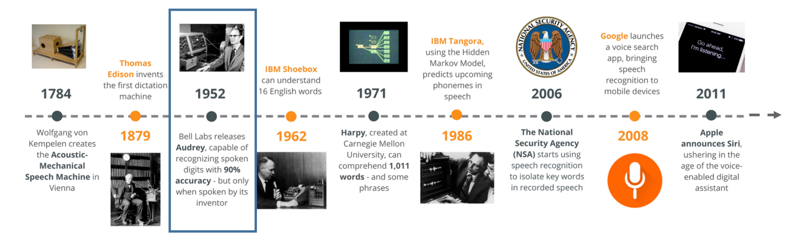

| 发展          | 技术萌芽                                           | 技术突破       | 产品化                         | 迭代更新               |
| ------------- | -------------------------------------------------- | -------------- | ------------------------------ | ---------------------- |
| 应用发展      | 贝尔实验室，识别10个英文数字(模板匹配)，特定说话人 | 识别词汇量：1k | IBM Via-Voice；剑桥HTK系统     | 智能家电               |
| 技术/算法发展 | 孤立词/少量词汇识别（模板+模型）                   | HMM            | GMM                            | DNN                    |
| 基础设施发展  | 现代电子计算机的出现                               | 机读时代 DL    | 互联网兴起更多电子化的语音数据 | big data+deep learning |

## 2. token的划分形式

| 形式                                              | 例子(en)                                                     | 例子(cn)                                                     |
| ------------------------------------------------- | ------------------------------------------------------------ | ------------------------------------------------------------ |
| word(中文中最小的具有语义的结构单元)              | one punch man  --> N=3,V>100K                                | "一个" "人"   --> N=2,V=???                                  |
| Morpheme(英语中最小的具有语义的结构单元)          | unbreakable --> "un","break","able"                          |                                                              |
| phoneme(一种语言中语音的“最小”单元)--> 元音、辅音 | cat  -->  K AET                                              |                                                              |
| Grapheme                                          | one_puch_man --> N=13,V=26+ " "+...                          | "一"，“个”，“人”  -->N=3,V约等于4000                         |
| Bytes（utf-8）                                    | 00100000                                                     | 10000100                                                     |
| 状态                                              | HMM-GMM中为3状态                                             | 把帧识别成状态（难点）。 把状态组合成音素。 把音素组合成单词。 |
| 单音素  vs  三音素                                | 单音素缺点1:建模单元数少  单音素缺点2:音素的发音受其所在上下文的影响 Kaldi中通过自顶向下的聚类自动构建问题集（决策树的构建） |                                                              |
| 三音子                                            | 由于人类发声器官运动的连续性，以及某些语言中特定的拼读习惯，会导致**音素的发音受到前后音素**的影响。为了对不同语境的音素加以区分，通常使用能够考虑前后各一个音素的三音子作为建模单元。 |                                                              |

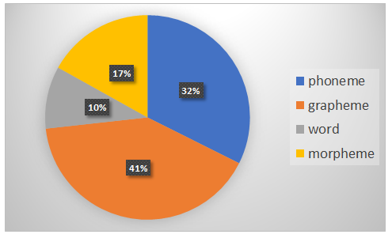

## 3. 声音特征处理

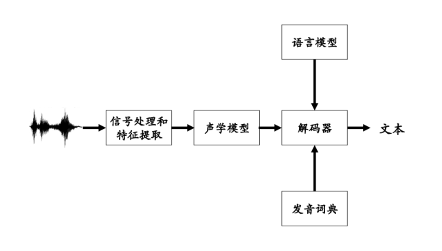

| 实体                                | 属性                                                         |      |
| ----------------------------------- | ------------------------------------------------------------ | ---- |
| 声音的可变性                        | 规模、说话人、声学环境、讲话人风格、口音方言、语种..         |      |
| 声音的格式                          | mp3：压缩格式     --转为非压缩的纯波形文件-->   PCM(wav)(除头文件以外，剩下的都为波形) |      |
| 声音信号的表示--波形                | 频率、振幅、强度、音色、周期                                 |      |
| 声音的转化（模拟信号-->数字信号）   | 为什么进行转换                                               |      |
| 声音的转化（时域到频域）            | 特征处理：语音信号--> 预加重 --> 分帧加窗 --> DFT  --频谱图-->   梅尔滤波器组 --> log--> .... |      |
| 采样率sampling rate（频率，单位Hz） | 采样的原则                                                   |      |

- **声音信号** ---**波形**

  - 多因子信息(Carries multifactorrial information)

  - 频率(Frequency)：越高的频率，越高（尖）的声音（能量越大）

  - 振幅(Amplitude)：越大的振幅，声音越响（能量越大）

  - Intensity, power, loudness：强度，力量，响度

  - 音色(Timbre)

  - 周期性与非周期性

    - 周期性：simple(单个正弦波)；；complex(多个不同频率/振幅/相位的正弦波的叠加)

    - 非周期性：连续的，短暂的

      

- **声音的转化（模拟信号-->数字信号）**

  - 模拟信号：时间维度是连续的、振幅是连续的

  - 数字信号：离散值的序列、 数据点只能包括有限的数量的值

  - 用正弦波进行采样，A=amplitude=振幅；f=频率； $\varphi$ =相位；t=time=时间（自变量）。

    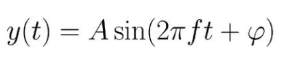

  

- **声音的转化（时域到频域）**

  - 语音信号--> 预加重 --> 分帧加窗 --> DFT  --频谱图-->   梅尔滤波器组 --> log
    - 为什么预加重：提高信号高频部分的能量,高频信号在传递过程中,衰减较快,但是高频部分又蕴含很多对语音识别有利的特征,因此在特征提取部分,需要提高高频部分能量。
    - 分帧加窗：用滑动窗来提取短时片段
    - 取log有两个目的:
      1)人耳对信号感知是近似对数的,高频部分较为敏感;
      2)对数使特征对输入信号的扰动不敏感。
  - MFCC特征一般用于对角GMM训练,各维度之间相关性小；Fbank特征一般用于DNN训练

- **采样率sampling rate（频率，单位Hz）**：25ms  -->  frame(400 sample point(16kHz),**39-dim MFCC**,80-dim filter bank output)   
  - 奈奎斯特采样定律：采样频率大于信号中最大频率的两倍。即在原始信号的一个周期内,至少要采样两个点,才能有效杜绝频率混叠问题。
  - 对于采样率为16kHz的信号,帧长、帧移一般为25ms、10ms,即400和160个采样点。
  - 一般常用的MFCC特征维39维

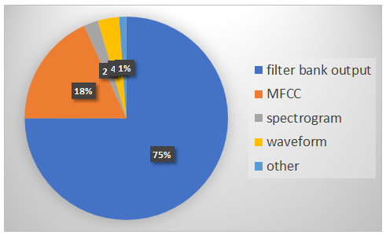

## 4. 数据集（主要是中文+噪声）

- 英文数据集

| 数据名称                                                     | 描述                                  |
| ------------------------------------------------------------ | ------------------------------------- |
| TIMIT                                                        | 音素识别， LDC版权                    |
| WSJ                                                          | 新闻播报， LDC版权                    |
| Switchboard                                                  | 电话对话， LDC版权                    |
| [Aurora4](http://aurora.hsnr.de/aurora-4.html)               | 鲁棒语音识别（WSJ加噪）               |
| [Librispeech](http://openslr.org/12/)                        | 有声读物， 1000小时，开源             |
| [AMI](http://openslr.org/16/)                                | 会议，开源                            |
| [TED-LIUM](http://openslr.org/19/)                           | 演讲，开源                            |
| CHiME-4                                                      | 平板远讲，需申请                      |
| [CHiME-5/6](https://blog.csdn.net/weixin_43202566/article/details/90611837) | 聚会聊天，需申请  英文视频+音频数据集 |

  > - [English数据集可见](https://github.com/jim-schwoebel/voice_datasets)
  > - 讨论Switchboard/CallHome subsets (SWB/CH)数据集： [English Conversational Telephone Speech Recognition by Humans and Machines, INTERSPEECH, 2017](https://arxiv.org/pdf/1703.02136.pdf)

- 中文数据集

| 数据名称                                                     | 大小(train+test)        | 描述                                                         | 开源否         |
| ------------------------------------------------------------ | ----------------------- | ------------------------------------------------------------ | -------------- |
| [aishell-1](http://openslr.org/33/)                   [more](http://www.aishelltech.com/kysjcp) | 178h                    | 400个不同国家的人(不同口音)，高音质，手动转录准确了95%以上     **采样：**44.1kHz & 16kHz  16bit          使用3种不同设备： 高保真麦克风（44.1kHz，16-bit）；Android系统手机（16kHz，16-bit）；iOS系统手机（16kHz，16-bit）。 | 学术           |
| [aishell_2](http://www.aishelltech.com/aishell_2)            | 1000h                   | 718小时来自AISHELL-ASR0009-[ZH-CN]，282小时来自AISHELL-ASR0010-[ZH-CN]。录音文本涉及唤醒词、语音控制词、智能家居、无人驾驶、工业生产等12个领域。录制过程在安静室内环境中， 同时使用3种不同设备： 高保真麦克风（44.1kHz，16bit）；Android系统手机（16kHz，16bit）；iOS系统手机（16kHz，16bit）。 | 申请           |
| [aishell-3](http://openslr.org/93/)                          | 85h+                    | emotion-neutral recordings spoken by 218 native Chinese mandarin | 学术           |
| [aishell翻译](http://www.aishelltech.com/aishell_2019C_eval) | 31.2h                   | 12人，采样：  44.1kHz & 16kHz  16bit                         | 申请           |
| [aishell家庭远近讲](http://www.aishelltech.com/aishell_2019A_eval) | 24.3h                   | 50人，采样：  44.1kHz & 16kHz  16bit                         | 申请           |
| [aishell唤醒](http://www.aishelltech.com/aishell_2019B_eval) | 437.67h                 | 86人，44.1kHz & 16kHz  16bit                                 | 申请           |
| [thchs_30](http://www.openslr.org/18/)                       | 40+h                    | 2002年，1万+语音，以 **文章诗句**为主                        | 学术           |
| [librispeech-360](http://openslr.org/12/)                    | 360h                    | 英文                                                         | 学术           |
| [VCTK](https://datashare.ed.ac.uk/handle/10283/2651)         | 多语者数据集            | English Multi-speaker Corpus for CSTR Voice Cloning Toolkit  |                |
| [Audioset](https://github.com/marc-moreaux/audioset_raw)     | 5.8k小时                | 涵盖了人类和动物的各种声音、乐器和流派以及常见的日常环境声音。527个类别，噪声数据集 |                |
| [MUSAN](http://openslr.org/17/)                              | 噪声数据集              | A corpus of music, speech, and noise                         |                |
| [primewords set1](http://www.openslr.org/47/)                | 178h                    | 由296名母语为英语的智能手机录制。转录准确度大于98％，置信水平为95％ | 学术           |
| [st-cmd](https://openslr.org/38/)                            | 100h+                   | 网上语音聊天和智能语音控制，855个不同说话者                  | 开源           |
| [magicdata](https://pan.baidu.com/s/1Se46gcCnFJGbQLmrhmVaTw)  4p13      [more](https://freedata.oss-cn-beijing.aliyuncs.com/MAGICDATA_Mandarin_Chinese_Speech.zip)                          [more](http://www.imagicdatatech.com/index.php/home/dataopensource/data_info/id/101) | 755h(712h+14.84h+28.8h) | 移动终端的录音数据.1080名演讲者参与录制。录音文本领域多样化，包括互动问答，音乐搜索，SNS信息，家庭指挥和控制等。还提供了分段的成绩单。该语料库旨在支持语音识别，机器翻译，说话人识别和其他语音相关领域的研究人员。 | 学术           |
| [aidatatang_200zh](http://www.openslr.org/62/)               | 200h+                   | 由Android系统手机（16kHz，16位）和iOS系统手机（16kHz，16位）记录,邀请来自中国不同重点区域的600名演讲者参加录音，录音是在安静的室内环境或环境中进行，其中包含不影响语音识别的背景噪音 | 开源           |
| [aidatatang_1505zh](https://www.datatang.com/webfront/opensource.html) | 1505h                   | 6408位来自中国不同地区的说话人                               | 申请           |
| [SLR38](http://www.openslr.org/38)                           | 8.2G                    | 855个speakers。每个演讲者有120个话语。                       |                |
| [DLHLP](https://docs.google.com/uc?export=download&id=1daFU8tPPUyhN7Fc6JUTohEfHXIn6ZDgq) | 2.9G                    |                                                              | 课程           |
| HKUST                                                        | 150小时                 | 电话对话                                                     | LDC版权        |
| 标贝                                                         | 50h                     | 49018句，主要用于语音合成                                    | 商用350,000,00 |

> - [语音情感数据集](https://blog.csdn.net/zsp123psz/article/details/107583653)
>
> - 身份、语种、内容、情绪情感、环境。。。
>
> - [自己收集数据集](https://www.yanxishe.com/TextTranslation/939)
> - 数据增广(波增强、谱增强、复制仿真)
>   - 加噪/变调变速(工具[sox](http://sox.sourceforge.net/)、[python包](https://github.com/makcedward/nlpaug))
>     - warp the freqency axis ：[Vocal Tract Length Perturbation (VTLP) improves speech recognition,2015](http://www.cs.toronto.edu/~ndjaitly/jaitly-icml13.pdf)
>     - label-preserving data augmentation approach:[Data Augmentation for Deep Neural Network Acoustic Modeling，2015]()
>     - 改变速度：[Audio augmentation for speech recognition,2015](https://www.danielpovey.com/files/2015_interspeech_augmentation.pdf)
>
> - **语谱增强(end2end实验)：**
>   - [SpecAugment: A Simple Data Augmentation Method for Automatic Speech Recognition，2019](https://arxiv.org/pdf/1904.08779.pdf)   [more](https://zhuanlan.zhihu.com/p/156614635)  [code](https://paperswithcode.com/paper/specaugment-a-simple-data-augmentation-method#code)
>   - - 数据仿真、TTS、GAN、对抗样本

## 5. ASR_deep_model(baseline)

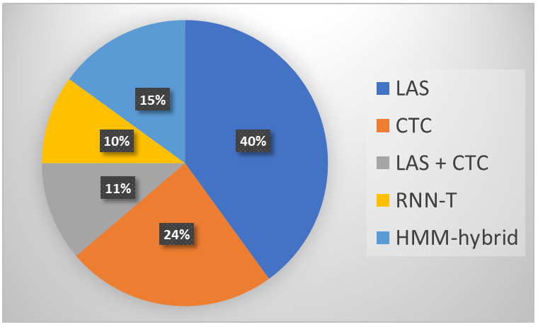

### 论文汇总1 baseline

| model                                                        | idea                                                         | 优势                                                         | 缺点                                                         |
| ------------------------------------------------------------ | ------------------------------------------------------------ | ------------------------------------------------------------ | ------------------------------------------------------------ |
| **HMM-GMM**                                                  | P(X\|Y)  --> P(X\|S)  HMM --> Acoustic Model P(Y)  Language Model sampling trick 区分性训练与模型自适应 | HMM 描述的是语音的短时平稳的动态性，GMM 用来描述 HMM 每一状态内部的发音特征。 参数少、易于嵌入终端设备 训练速度快 可基于孤立词、单因素、三因素 | 不能利用语境信息(帧的上下文)，建模能力有限                   |
| **DNN-HMM**                                                  | state classifier DNN对环境的高适应性（CNN-RNN-LSTM-BiLSTM）对齐工作 | DNN适合特征映射到独立空间，LSTM具有长短时记忆能力，CNN擅长减少语音信号的多样性 解决了GMM对数据表示效率低下的问题 | 对过长的声音信号无法处理，不能对历史信息来辅助当前任务       |
| [LSA](https://github.com/kaituoxu/Listen-Attend-Spell) [paper2015](https://arxiv.org/pdf/1508.01211.pdf) | Listen,Attend + Spell  --> seq2seq   decoder <--attention |                                                              | encoder为RNN依赖于前一时刻的输出，非实时                     |
| [CTC,2006](https://www.cs.toronto.edu/~graves/icml_2006.pdf) | connectionist Temporal Classification take one vector as input,Output one token 引入空白标签、输入一个输出一个 系统会一直保留一个内部状态，当这个内部的状态提供足够的信息可以做某一个决定的时候，它就会生成一个尖峰（spike）。而在没有听到足够的信息的时候，只会产生空信号以表明还不能有足够的信息来判断是不是听到了某一个字或者词。 | Streaming Speech Recognition（Bi-RNN需要全局信息，无法进行实时识别/所以有些改进是基于一定缓冲作为双向RNN） 某些场景下建模单元越长、越大，识别效果就越好 word-based CTC模型有训练困难及收敛慢的问题 有帧间独立性假设 假设序列相对独立，同时需要加LM | possible alignment有很多，需要beam search 输出独立性假设 好的性能需要加上LM |
| [Joint LAS-CTC,2017](https://arxiv.org/pdf/1609.06773.pdf)   [code](https://paperswithcode.com/paper/joint-ctc-attention-based-end-to-end-speech#code) | CTC decoder (vs) Attention decoder                           | Attention-based模型训练更加困难，且有不能单调地从左到右对齐及收敛更慢的缺点。通过将 CTC 目标函数用作辅助代价函数，Attention训练和 CTC 训练以一种多任务学习的方式结合到了一起。这种训练策略能够很大程度上改善Attention-based模型的收敛问题，并且缓解了对齐问题。 |                                                              |
| [RNN-T(RNN transducer),2012](https://arxiv.org/pdf/1211.3711.pdf)  [code](https://paperswithcode.com/paper/sequence-transduction-with-recurrent-neural#code) | Can one vector map to  multiple tokens?                      | 输入一个输出多个                                             | 存在alignments问题,memory consuming大                        |
| **Attention-Based**                                          |                                                              |                                                              |                                                              |
| [Neural Transducer](https://arxiv.org/pdf/1511.04868.pdf)    | 对input进行滑动窗口的方式                                    | 每次输入一个window的RNN-T                                    | An Online Sequence-to-Sequence Model Using Partial Conditioning, NIPS, 2016 |
| [MoChA,2018](https://arxiv.org/pdf/1712.05382.pdf)  [code](https://github.com/craffel/mocha)  [more](https://arxiv.org/pdf/1704.00784.pdf) | Monotonic Chunkwise Attention  yes or no?  Stop and send information to decoder? | window 移动伸缩自如的Neural Transducer                       | Monotonic Chunkwise Attention                                |
| [Speech Transformer](https://github.com/kaituoxu/Speech-Transformer)  [paper](https://sci-hub.ren/10.1109/icassp.2018.8462506)   [code](https://gitee.com/carollia/Speech-Transformer) | 替换了RNN，使用基于注意力机制的Transformer对时序序列进行建模。 | 易并行计算                                                   | 非流式                                                       |

> [评估标准](https://github.com/syhw/wer_are_we)  : accuracy(WER\CER\SER) + efficiency(real-time factor,RTF)

> -  alignment
>    - 
> -  深度学习可以把噪声、回响看为新的特征，并通过对有噪声、回响数据的学习，达到比较理想的识别性能。
> -  解码：beam search、Viterbi

### 5.1 **HMM-GMM**

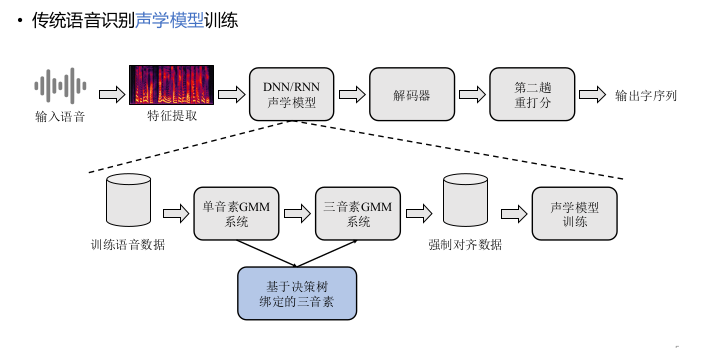

- 状态转移概率密度多采用**几何分布建模**，而**拟合隐变量到观测值的观测概率的模型常用高斯混合模型（GMM）**。

- 

  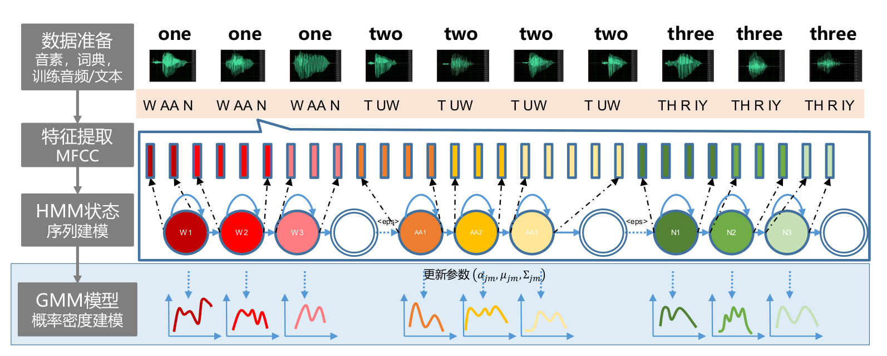

  

### 5.2 DNN-HMM

- 基于深度学习的发展，深度神经网络（DNN）、卷积神经网络（CNN）、循环神经网络（RNN）等模型被应用到观测概率的建模中，并取得了非常好的效果。应用于CNN模型，可以克服传统语音识别中采用时间、频率而导致的不稳定问题。DBN和CNN模型没有考虑语音之间的关联信息。而RNN模型，充分考虑了语音之间的相互关系，因此取得更加好的效果。现有的最好的基于深度学习的语音识别一般是基于DBN+CNN+RNN模型的。

### 5.3 LSA

- 
- **Listen**
  - Bi-LSTM
    - 前几层CNN，后几层RNN
    - self-attention layer
    - 做下采样
  - Attention
    - Additive Attention：Location-aware attention  vanila model
  - Spell
  - traning：teacher force

> https://paperswithcode.com/paper/listen-attend-and-spell

### 5.4 CTC

### 5.5 **LAS+CTC：**

- Joint CTC-attention based end-to-end speech recognition using multi-task lea

### 5.6  RNN-T

### 5.7 **Neural Transducer  ：**

- windows size：

### 5.8 MochA

### 5.9 speech_transformer

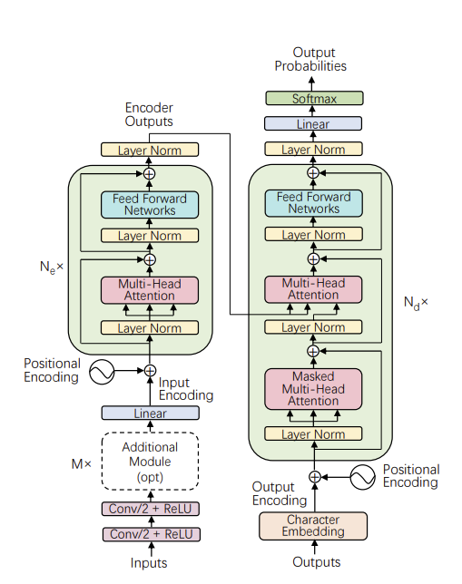

## 6. LSA_based

## 7. RNN-T based

## 8. CTC based

## 9. AED

## 10. Unified and rescoring 

## 11. Streaming ASR (on device) 

## 12. code-switching

- 

## 6. ASR_deep_based_model

### 论文汇总2 based

| 模型                                | **trick**                                                    | **paper**                                                    | WER /dataset                                                 |
| ----------------------------------- | ------------------------------------------------------------ | ------------------------------------------------------------ | ------------------------------------------------------------ |
| **based on CNN**                    | 时延神经网络（TDNN）、CNN-DNN、CNN-LSTM-DNN（CLDNN）、CNN-DNN-LSTM（CDL）、深度CNN、逐层语境扩展和注意（LACE）CNN、dilated CNN。 | CNN局部特征提取且有限时序建模能                              |                                                              |
| HMM-CNN                             | CNN+HMM                                                      | [Exploring Convolutional Neural Network Structures and Optimization Techniques for Speech Recognition,2013](https://www.microsoft.com/en-us/research/wp-content/uploads/2016/02/CNN-Interspeech2013_pub.pdf) |                                                              |
| LACEA                               | LAyer-wise Context Expansion and Attention (LACEA) + stride  | [Deep Convolutional Neural Networks with Layer-wise Context Expansion and Attention, INTERSPEECH, 2016](https://www.microsoft.com/en-us/research/wp-content/uploads/2016/06/DeepCNNWithAttention-Interspeech2016.pdf) |                                                              |
| TDNN                                | a time delay neural network architecture training time 更短 | [A time delay neural network architecture for efficient modeling of long temporal contexts,2015](https://www.danielpovey.com/files/2015_interspeech_multisplice.pdf) [A Fast-Converged Acoustic Modeling for Korean Speech Recognition: A Preliminary Study on Time Delay Neural Network,2018](https://arxiv.org/pdf/1807.05855.pdf)           [github](https://github.com/cvqluu/TDNN) |                                                              |
| MCNN-CTC                            | 深度多路卷积神经网络，解决了宽度上的限制，获取了更多时域和频域上的信息，基于CTC损失函数构建了一个MCNN模型。 | [Towards_End-to-End_Speech_Recognition_with_Deep_Multipath_Convolutional_Neural_Networks，2019](https://ton-1256103648.cos-website.ap-chengdu.myqcloud.com/Towards_End-to-End_Speech_Recognition_with_Deep_Multipath_Convolutional_Neural_Networks.pdf)  [more](https://zhuanlan.zhihu.com/p/74880849)     [github](https://github.com/zw76859420/ASR_Syllable) | 在没有语言模型的情况下，可将端到端声学模型的错误率相比DCNN-CTC模型下降1.10%-12.08%（Thchs30和ST-CMDS，GTX 1080Ti） |
| full-CONV                           | End-to-end CNN on the waveform + conv LM                     | [Fully Convolutional Speech Recognition](https://arxiv.org/abs/1812.06864) |                                                              |
| **based on RNN / RNN-T**            | 多隐层的长短期记忆网络（LSTM）、highway LSTM、ResidualLSTM、双向LSTM、时延控制的双向LSTM。 | RNN记忆和时序建模能力  [Deep Recurrent Neural Networks for Acoustic Modelling,2015(TC-DNN-BLSTM-DNN)](https://arxiv.org/pdf/1504.01482v1.pdf) |                                                              |
|                                     | 讨论Switchboard/CallHome subsets (SWB/CH)数据集      BiLSTM+feature fusion residual nets LM | [English Conversational Telephone Speech Recognition by Humans and Machines, INTERSPEECH, 2017](https://arxiv.org/pdf/1703.02136.pdf) |                                                              |
| Highway LSTM                        | HW-LSTM LM trained with Switchboard+Fisher+Gigaword+Broadcast News+Conversations, AM from [previous IBM paper](https://arxiv.org/abs/1703.02136) | [Language Modeling with Highway LSTM](https://arxiv.org/abs/1709.06436) |                                                              |
| LSTMP                               | LSTMP - LSTM with Recurrent Projection Layer ,Long Short-Term Memory    Projected   RNN+ deep RNN | [Long Short-Term Memory Based Recurrent Neural Network Architectures for Large Vocabulary Speech Recognition,2014](https://static.googleusercontent.com/media/research.google.com/zh-CN//pubs/archive/43905.pdf)     [github](https://github.com/Marcovaldong/lstmp.pytorch) |                                                              |
| CLDNN                               | CNN(convolutional layers)+LSTM+DNN(fully connects)           | [Convolutional,Long Short-Term Memory, fully connected Deep Neural Networks,2015](https://static.googleusercontent.com/media/research.google.com/zh-CN//pubs/archive/43455.pdf) | a 4-6% relative improvement in WER over an LSTM              |
| **based on LSA**                    |                                                              |                                                              |                                                              |
|                                     |                                                              | [A Comparison of Transformer and LSTM Encoder Decoder Models for ASR, ASRU, 2019](https://blog.csdn.net/pitaojun/article/details/108628019) |                                                              |
|                                     |                                                              | [A Comparative Study on Transformer vs RNN in Speech Applications, ASRU, 2019](https://arxiv.org/pdf/1909.06317.pdf)      [code](https://paperswithcode.com/paper/a-comparative-study-on-transformer-vs-rnn-in#code) |                                                              |
|                                     |                                                              | [End-to-End Attention-based Large Vocabulary Speech Recognition,2016](https://arxiv.org/pdf/1508.04395.pdf)    [github](https://github.com/rizar/attention-lvcsr) |                                                              |
| **based on transformer**            |                                                              |                                                              |                                                              |
| Transformer-Transducer              |                                                              | [Transformer-Transducer: End-to-End Speech Recognition with Self-Attention,2019](https://arxiv.org/pdf/1910.12977.pdf) |                                                              |
| Conv-Transformer Transducer         | streaming                                                    | [Conv-Transformer Transducer: Low Latency, Low Frame Rate, Streamable End-to-End Speech Recognition,2020](http://www.interspeech2020.org/uploadfile/pdf/Thu-3-10-2.pdf) |                                                              |
|                                     |                                                              | [Dual-mode ASR: Unify and Improve Streaming ASR with Full-context Modeling](https://arxiv.org/pdf/2010.06030.pdf) |                                                              |
| **based on  AED**                   |                                                              |                                                              |                                                              |
|                                     |                                                              |                                                              |                                                              |
| **based on MONOTONIC Attention**    |                                                              |                                                              |                                                              |
| MoChA                               | decoder解决时空复杂度                                        | [Montonic Chunkwise Attention](https://arxiv.org/pdf/1712.05382.pdf) (ICLR 2018)   [github](https://github.com/craffel/mocha) |                                                              |
| Enhancing MoChA                     | monotonic multihead attention(hard monotonic attention)、HeadDrop，tackled the alignment issue | [Enhancing Monotonic Multihead Attention for Streaming ASR](https://arxiv.org/pdf/2005.09394.pdf) (Interspeech 2020)    [github](https://github.com/hirofumi0810/neural_sp) |                                                              |
| DeCoT、MinLT                        | Minimum Latency Training based on Montomic Attention         | [Minimum Latency Training Strategies For Streaming seq-to-seq ASR](https://arxiv.org/pdf/2004.05009.pdf) (ICASSP 2020) |                                                              |
| **based on Triggered Attention**    |                                                              |                                                              |                                                              |
| Triggered Attention                 |                                                              | [Triggered Attention for End-to-End Speech Recognition](https://www.merl.com/publications/docs/TR2019-015.pdf) (ICASSP 2019) |                                                              |
| Triggered Attention for Transformer | alingment对齐                                                | [Streaming Automatic Speech Recognition With The Transformer Model](https://arxiv.org/pdf/2001.02674.pdf) (ICASSP 2020) |                                                              |
| **Memory Augmented Attention**      |                                                              |                                                              |                                                              |
| SCAMA                               | latency control memory                                       | [Streaming Chunk-Aware Multihead Attention for Online End-to-End Speech Recognition](https://arxiv.org/pdf/2006.01712.pdf) (Interspeech 2020) |                                                              |

## 7. ASR_deep_model(sota)

### 论文汇总3 sota

| model                   | trick                                                        | paper and code                                               | 类别                                            | WER    | time   |
| ----------------------- | ------------------------------------------------------------ | ------------------------------------------------------------ | ----------------------------------------------- | ------ | ------ |
| LPM                     | Local Prior Matching、unlabelled data on a standard,semi-supervised | [Semi-Supervised Speech Recognition via Local Prior Matching,2020](https://arxiv.org/pdf/2002.10336v1.pdf)  [code,C++](https://github.com/facebookresearch/wav2letter/tree/master/recipes/local_prior_match) | 没看懂                                          | 7.19   |        |
| CTC + policy learning   | by jointly training with maximum likelihood and policy gradient. | [Improving End-to-End Speech Recognition with Policy Learning,2017](https://arxiv.org/pdf/1712.07101v1.pdf) | 强化学习                                        | 5.42   |        |
| CNN + Transformer       | 2 CNN + 24 layers Transformer encoder and 12 layers Transformer decoder model with char BPE and phoneme BPE units. | [An investigation of phone-based subword units for end-to-end speech recognition](https://arxiv.org/pdf/2004.04290.pdf) |                                                 |        |        |
| **wav2letter**          | wav2letter(CTC) + CNN + Gated ConvNets                       | [LETTER-BASED SPEECH RECOGNITION WITH GATED CONVNETS,2019](https://arxiv.org/pdf/1712.09444v2.pdf)  [code1](https://github.com/silversparro/wav2letter.pytorch)   [code2](https://github.com/LearnedVector/Wav2Letter)  [paper2,2016](https://arxiv.org/pdf/1609.03193.pdf) | letter                                          | 4.8    |        |
| >< **CTC_CRF**          | CRF + CTC + 4-gram LM                                        | [CRF-based Single-stage Acoustic Modeling with CTC Topology. ICASSP, 2019](http://oa.ee.tsinghua.edu.cn/~ouzhijian/pdf/ctc-crf.pdf)  [code](https://github.com/thu-spmi/cat) | 传统+深度                                       | 4.09   |        |
| attention               | attention+pretraning                                         | [Improved training of end-to-end attention models for speech recognition Albert,2018](https://arxiv.org/pdf/1805.03294v1.pdf)    [code](https://paperswithcode.com/paper/improved-training-of-end-to-end-attention) | attention                                       | 3.82   |        |
| >< **Jasper**           | CNN + layer-wise optimizer called NovoGrad                   | [Jasper: An End-to-End Convolutional Neural Acoustic Model,2020](https://arxiv.org/pdf/1904.03288v3.pdf)     [code](https://github.com/sooftware/jasper) | CNN                                             | 2.95   |        |
| **transformer**         | transformer vs RNN                                           | [A Comparative Study on Transformer vs RNN in Speech Applications,2019](https://arxiv.org/pdf/1909.06317v2.pdf)    [Transformer-based Acoustic Modeling for Hybrid Speech Recognition](https://arxiv.org/abs/1910.09799) | transformer                                     | 2.6    |        |
| **ContextNet**          | CNN-RNN-Transducer(ContextNet) + 3-layer LSTM LM (data augmentation:SpecAugment) | [ContextNet: Improving Convolutional Neural Networks for Automatic Speech Recognition with Global Context,2020](https://arxiv.org/pdf/2005.03191v3.pdf)   [code](https://github.com/TensorSpeech/TensorFlowASR/tree/main/examples/contextnet) | CNN                                             | 2      |        |
| **TDNN+self-attention** | Multi-stream self-attention in hybrid ASR + 4-gram LM + Neural LM rescore (no data augmentation) | [State-of-the-Art Speech Recognition Using Multi-Stream Self-Attention With Dilated 1D Convolutions,2019](https://arxiv.org/pdf/1910.00716v1.pdf)   [code](https://github.com/s-omranpour/ConvolutionalSpeechRecognition) | self-attention                                  | 2.2    |        |
| **Conformer**           | Convolution-augmented-Transformer(Conformer) + 3-layer LSTM LM (data augmentation:SpecAugment) | [Conformer: Convolution-augmented Transformer for Speech Recognition](https://arxiv.org/pdf/2005.08100v1.pdf)     [code](https://paperswithcode.com/paper/conformer-convolution-augmented-transformer) | CNN+RNN++                                       |        | 3.19   |
| **wav2vec2.0**          |                                                              | [wav2vec 2.0: A Framework for Self-Supervised Learning of Speech Representations]()    [code](https://paperswithcode.com/paper/wav2vec-2-0-a-framework-for-self-supervised) | Self-Supervised Learning                        |        |        |
| **Unified**             | ----------------------------------------------               | ----------------------------------------------------         | --------------------------                      | ------ | ------ |
| Dual-mode ASR           | Dual-mode ASR,Universal ASR                                  | [Universal ASR: Unify And Improve Streaming ASR With Full-Context Modeling,2021](https://openreview.net/pdf?id=Pz_dcqfcKW8) | Unified                                         |        | 3.20   |
| >< **U2**               | Unified Streaming and Non-streaming，Conformer Encoder + CTC/attention loss | [Unified Streaming and Non-streaming Two-pass End-to-end Model for Speech Recognition,2020](https://arxiv.org/pdf/2012.05481v1.pdf)  [wenet]() [code1](https://github.com/TeaPoly/Conformer-Athena)   [code2](https://github.com/mobvoi/wenet) | Unified                                         |        | 3.19   |
| google Two-Pass         | RNN-Transducer                                               | [Two-Pass End-to-End Speech Recognition,2019](https://arxiv.org/pdf/1908.10992.pdf)    [code](https://github.com/fd873630/RNN-Transducer) | Unified                                         |        | 3.20   |
| Parallel Rescoring      | Parallel Rescoring+ transformer                              | [Parallel Rescoring with Transformer for Streaming On-Device Speech Recognition,2020](https://arxiv.org/pdf/2008.13093.pdf) | Unified                                         |        | 3.20   |
| One In A Hundred        | 2-pass unifying (1st Streaming CTC, 2nd Attention Rescore)   | [One In A Hundred: Select The Best Predicted Sequence from Numerous Candidates for Streaming Speech Recognition,2020](https://arxiv.org/pdf/2010.14791.pdf)    [code](https://github.com/ZhengkunTian/OneInAHundred) | Unified                                         |        | 3.20   |
| Transformer Transducer  | 什么是Y-model？不懂                                          | [Transformer Transducer: One Model Unifying Streaming And Non-Streaming Speech Recognition,2020](https://arxiv.org/pdf/2010.03192.pdf) | Unified                                         |        | 3.20   |
|                         |                                                              |                                                              |                                                 |        |        |
| encoders                | Cascaded encoders级联                                        | [Cascaded encoders for unifying streaming and non-streaming ASR,2020](https://arxiv.org/pdf/2010.14606.pdf) | Unified                                         |        | 3.20   |
| inference technique     | based on RNN-T,Dynamic latency、Asynchronous Revision??不懂  | [Dynamic latency speech recognition with asynchronous revision,2021](https://arxiv.org/pdf/2011.01570.pdf) | Unified                                         |        | 3.20   |
| MoChA_BFA               |                                                              | [Utterance invariant training for hybrid two-pass end-to-end speech recognition,2020]( https://www.isca-speech.org/archive/Interspeech_2020/pdfs/3230.pdf) | Unified                                         |        |        |
| **Rescoring**           | ----------------------------------------------               | ----------------------------------------------------         | --------------------------                      | ------ | ------ |
| review                  |                                                              | [Automatic Speech Recognition Errors Detection and Correction: A Review,2018](https://www.sci-hub.ren/10.1016/j.procs.2018.03.005) | Rescoring/Spelling Correction (2-pass decoding) |        |        |
|                         |                                                              |                                                              | On-device review                                |        |        |
|                         | Attention                                                    | [Thank you for Attention: A survey on Attention-based Artificial Neural Networks for Automatic Speech Recognition](https://arxiv.org/abs/2102.07259) | Attention                                       |        |        |
|                         | 多语言语种,用一个model进行建模                               |                                                              |                                                 |        |        |

### 6.1 conformer

### 6.2 U2 and wenet

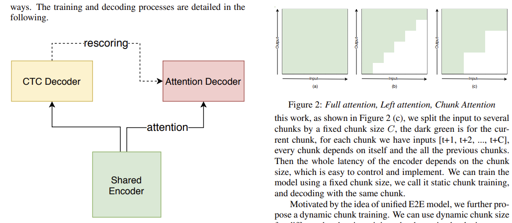

## 7. code-switching

| model | idea                              | paper/code                                                   |
| ----- | --------------------------------- | ------------------------------------------------------------ |
|       | 双encoder+双decoder-->CTC联合建模 | [Multi-Encoder-Decoder Transformer for Code-Switching Speech Recognition,2020](https://arxiv.org/pdf/2006.10414.pdf) |
|       | model中加入区分EN和CN的标记       | [Rnn-transducer with language bias for end-to-end Mandarin-English code-switching speech recognition,2020](https://arxiv.org/pdf/2002.08126.pdf) |
|       |                                   |                                                              |

> [github paper](https://github.com/gentaiscool/code-switching-papers)
>
> https://code-switching.github.io/2021

## 8. 口音识别

| model                           | idea                                                         | paper/code                                                   |
| ------------------------------- | ------------------------------------------------------------ | ------------------------------------------------------------ |
|                                 |                                                              | [PSEUDO LIKELIHOOD CORRECTION TECHNIQUE FOR LOW RESOURCE ACCENTED ASR](https://sci-hub.ren/10.1109/icassp40776.2020.9053647) |
|                                 | multi-accent、x-vector embedding                             | [Achieving multi-accent ASR via unsupervised acoustic model adaptation](https://hal.inria.fr/hal-02907929/document) |
| **MAML**                        | 元学习+自适应                                                | [Learning Fast Adaptation on Cross-Accented Speech Recognition](https://arxiv.org/pdf/2003.01901.pdf)     [code](https://github.com/audioku/cross-accent-maml-asr) |
| frame-level attention mechanism | attention in attention+ speaker-adaptive                     | [Speaker Adaptive Training for Speech Recognition Based on Attention-over-Attention Mechanism,2020](isca-speech.org/archive/Interspeech_2020/pdfs/1727.pdf) |
| **SAR-Net**                     | cluster,ASR+AR                                               | [SAR-Net: A End-to-End Deep Speech Accent Recognition Network,AESRC2020](https://arxiv.org/pdf/2011.12461v3.pdf)     [code](https://github.com/coolEphemeroptera/AESRC2020)   [more](https://github.com/R1ckShi/AESRC2020) |
| **数据集构建**                  | youtube语音数据集爬取和构建                                  | [KT-Speech-Crawler: Automatic Dataset Construction for Speech Recognition from YouTube Videos,2016](https://arxiv.org/pdf/1903.00216v1.pdf)    [code](https://github.com/EgorLakomkin/KTSpeechCrawler) |
|                                 | 系统级别                                                     | [Black-box Adaptation of ASR for Accented Speech](https://arxiv.org/pdf/2006.13519v1.pdf)   [code](https://github.com/Kartik14/FineMerge) |
| 检索口语标记                    | a model that automatically retrieves phonological generalizations from a small dataset(用处好像不大) | [Foreign English Accent Adjustment by Learning Phonetic Patterns,2018](https://arxiv.org/pdf/1807.03625v1.pdf)    [code](https://github.com/CiscoAI/accent_transfer) |
| 每提出新的model                 | 验证finetuning techniques  结巴(dysarthric)和口音            | [Personalizing ASR for Dysarthric and Accented Speech with Limited Data,2019](https://arxiv.org/pdf/1907.13511v1.pdf)    [code](https://github.com/DataScienceNigeria/Automatic-speech-recognition-ASR-systems-from-googleAI-and-ALSTDI) |
|                                 |                                                              | https://www.isca-speech.org/archive/Interspeech_2018/pdfs/1864.pdf |

> https://paperswithcode.com/search?q_meta=&q=accent+speech
>
> https://arxiv.org/abs/2102.10233
>
> https://stanford.edu/~jurafsky/p1304.pdf

## 9. 语音增强

| model | idea                       | paper                                                        |
| ----- | -------------------------- | ------------------------------------------------------------ |
| CRM   | 控制残留噪声，避免语音失真 | [Constrained Ratio Mask for Speech Enhancement Using DNN](https://indico2.conference4me.psnc.pl/event/35/contributions/3958/attachments/1006/1047/Wed-1-11-4.pdf) |
|       |                            |                                                              |
|       |                            | 、                                                           |

https://github.com/syhw/wer_are_we  

https://paperswithcode.com/sota/distant-speech-recognition-on-chime-4-real

## 10. 语音分离（none）

- 时域  vs  频域

  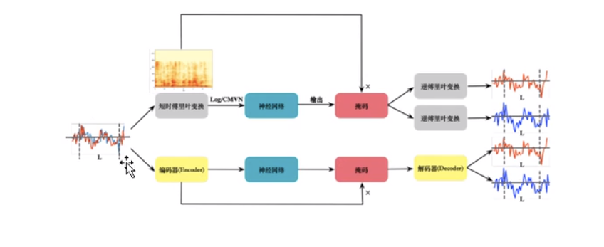

| model         | idea                           | paper                                                        |
| ------------- | ------------------------------ | ------------------------------------------------------------ |
| Vid2speech    | audio-visual speech separation | [Seeing Through Noise: Visually Driven Speaker Separation and Enhancement](https://arxiv.org/pdf/1708.06767.pdf) |
|               |                                | [deep audio-visual speech separation with attention mechanism](https://www.sci-hub.ren/10.1109/icassp40776.2020.9054180) |
| based on 时域 |                                |                                                              |
|               |                                |                                                              |
| based on 频域 |                                |                                                              |

> [github](https://github.com/speech-separation-hse/TIME-DOMAIN-AUDIO-VISUAL-SPEECH-SEPARATION)

## 10. noise

- 方案：
  - massive real data training
  - front-end speech signal processing-->speech enhancement 语音增强+ data augmentation  （增强和end_to_end怎么结合）
  - transfer learning(model clean-->model noisy)
  - multi-channel data

> 语音增强后存在失真的现象，不仅不会提升ASR性能，有时候反而会降低其性能；利用增强后的语音重新训练ASR模型不仅不带来计算资源的损耗，同时也有不一样的效果
>
> 正作用：语音降噪
>
> 负作用：语音失真(信息丢失)

## 11. 语言模型LM

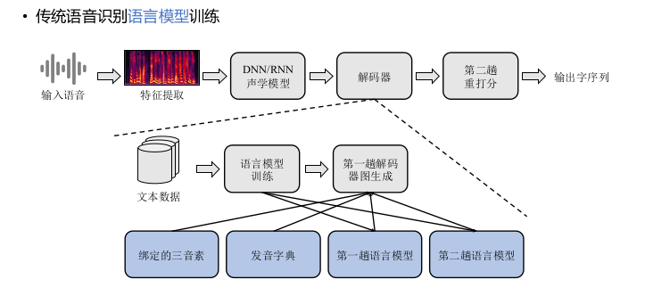

加上语音模型LM：

- N-gram LM + smothing
- NN-based LM
- RNN-based LM
  - [Ko, et al., ICASSP’17] Wei-Jen Ko, Bo-Hsiang Tseng, Hung-yi Lee, “Recurrent Neural Network based Language Modeling with Controllable External Memory”, ICASSP, 2017
  - [Merity, et al., ICLR’18] Stephen Merity, Nitish Shirish Keskar, Richard Socher, Regularizing and optimizing LSTM language models, ICLR, 2018
- RNN LM + LAS
  - shallow fusion：after traning + output： [Kannan, et al., ICASSP’18] Anjuli Kannan, Yonghui Wu, Patrick Nguyen, Tara N. Sainath, Zhifeng Chen, Rohit Prabhavalkar, An analysis of incorporating an external language model into a sequence-to-sequence model, ICASSP, 2018
  - Deep fusion：after traning + Hidden：[Gulcehre, et al., arXiv’15] Caglar Gulcehre, Orhan Firat, Kelvin Xu, Kyunghyun Cho, Loic Barrault, Huei-Chi Lin, Fethi Bougares, Holger Schwenk, Yoshua Bengio, On Using Monolingual Corpora in Neural Machine Translation, arXiv, 2015
  - Cold fusion : before traning + hidden：[Sriram, et al., INTERSPEECH’18] Anuroop Sriram, Heewoo Jun, Sanjeev Satheesh, Adam Coates, Cold Fusion: Training Seq2Seq Models Together with Language Models, INTERSPEECH, 2018
  - State-of-the-art Speech Recognition With Sequence-to-Sequence Models

## 7. 解码器

- acoustic model + language model  --  简单解码
- Viterbi算法理论上准确有效的完成了解码工作,实际上有什么问题?
  - 思想:Beam Search去除没有竞争力的路径。
  - WFST构图

## 8. 构建语音识别系统

### 8.1 企业应用

| model                                                        | idea                                                         |                          |
| ------------------------------------------------------------ | ------------------------------------------------------------ | ------------------------ |
| DFCNN(科大讯飞)  [more](https://blog.csdn.net/chinatelecom08/article/details/85013535) | 全卷积，多个卷积之后加上池化（直接将一句语音转为一张图片作为输入，即先对时间和频率作为图像的两个维度，然后通过非常多的卷积层和池化层的组合，对整句语音进行建模，输出单元直接与最终的识别结果比如音节或汉字对应） |                          |
| [LFR-DFSMN(阿里)](https://github.com/alibaba/Alibaba-MIT-Speech) | FNN的隐层增加可学习的记忆模块，有能力对长时相关的信号进行建模（DFSMN的跳转避免了深层网络的梯度消失问题，可训练更深的网络） |                          |
| SMLTA(百度)                                                  | LSTM+CTC+Attention-->获取更大范围和更有层次的上下文信息      |                          |
| [DeepSpeech(Deep CNN)](https://deepspeech.readthedocs.io/)  [more](https://github.com/MyrtleSoftware/deepspeech) | 使用VGGNet+Residual+深层CNN，并结合LSTM和CTC的端到端（深层CNN-->提升HMM语音识别的性能+CTC语音识别的性能） |                          |
| [deepspeech2](https://arxiv.org/pdf/1512.02595v1.pdf)   [code](https://paperswithcode.com/paper/deep-speech-2-end-to-end-speech-recognition) |                                                              |                          |
| [athena](https://github.com/athena-team/athena)              |                                                              |                          |
| wav2letter++                                                 | https://arxiv.org/abs/1812.07625                             |                          |
| Snips Voice Platform                                         | [paper](https://paperswithcode.com/paper/snips-voice-platform-an-embedded-spoken) |                          |
| [PyTorch-Kaldi](https://github.com/mravanelli/pytorch-kaldi) | [paper](https://paperswithcode.com/paper/the-pytorch-kaldi-speech-recognition-toolkit) |                          |
| [tencent pika](https://github.com/tencent-ailab/pika)        | 轻量级语音处理工具包PIKA+torch+使用kaldi进行数据格式化和特征提取 |                          |
| [Kaldi](http://kaldi-asr.org/ )  学术传统                    | C++,python                                                   |                          |
| [Espnet](https://github.com/espnet/espnet)  学术deep         | 实现了主流的端到端语音识别方法 Speech-Transformer、 LAS、 CTC、 RNN-T 一个小缺点： 代码量已经越来越多… |                          |
| [出门问问wenet](https://zhuanlan.zhihu.com/p/349586567)  [more](https://zhuanlan.zhihu.com/p/344748090) 工业deep | 使用conformer网络结构和CTC/attention loss联合优化方法，具有业界一流的识别效果。 | 3.19 开源，torch值得学习 |
| [tensorflowASR](https://github.com/Z-yq/TensorflowASR)  [more](https://zhuanlan.zhihu.com/p/182848910) | Conformer、ESPNet、DeepSpeech2、Transformer                  | 开源，tensorflow         |

> 企业级应用需要10万小时+的数据作为支撑。
>
> 产品化：[思必达](http://www.aispeech.com/)、[声智科技](http://www.soundai.com/)、[Rasa集成语音](https://dustyposa.github.io/posts/d7e97916/)

### 8.2 技术趋势

/root/miniconda3/envs/wenet/bin:/root/miniconda3/condabin:/usr/local/sbin:/usr/local/bin:/usr/sbin:/usr/bin:/sbin:/bin

- **远场语音识别**

  - “ 鸡尾酒会问题”（cocktail party problem）-->回声消除技术...
    - 加上语音分离(分离环境声音和人声)和语音增强、说话人识别
    - Deep Clustering：语谱图分割成两个集群，一个属于说话人 A，一个属于说话人 B，进而训练一个嵌入空间表达。但是同时聚类算法的引入也带来了一些问题，使得训练和识别变得相对复杂，也不易于与其他方法融合。
    - **Permutation Invariant Training**：在多个说话人距离较远的情况下，波束形成是一个比较好的解决方案，但是当多个说话人距离很近的时候，波束形成的语音分离效果也很差。为了避开波束形成所带来的场景分类问题，传统的方法多是在单通道下尝试解决该问题，例如deep Clustering。但是这些方法只有当噪声信号（除声源外的其他信号）与声音源信号有明显不同的特征时，这些技术才取得比较好的效果。其它情况下，这些方法在语音分离中取得的效果一般。
  - 噪声下的语音识别仍有待突破。信号处理擅长处理线性问题，深度学习擅长处理非线性问题，而实际问题一定是线性和非线性的叠加，因此一定是两者融合才有可能更好地解决噪声下的语音识别问题。
  - 前端利用**麦克风阵列**做去混响、波束形成等信号处理，以让语音更清晰
    - 使用多麦克风采集多路时频信号，利用卷积神经网络学习波束形成，从而在目标信号的方向形成一个拾音波束，并衰减来自其他方向的反射声。
  - 后端以语音识别技术为主**（deep，可见5. ASR_deep_model）**
    - 更有效的seq2seq直接转换模型
    - 带有attention的seq2seq模型：这个模型基本的想法是首先把输入的序列、语音信号序列，转换成一个**中间层**的序列表达，然后基于中间层的序列表达提供足够的信息给一个专门的、基于递归神经网络的生成模型，并每次生成一个字、一个词或者一个音符。【问题 1：训练和识别过程有很大的不匹配性，在训练过程中所依赖的信息是准确的、已知的，但是在识别过程中，信息却是估算出来的，是不准确的。所以一旦错误产生以后，这个错误就可能会累加到下一个字或词的生成，所以该方法比较适合只是一个短语的识别，对长的句子效果比较差。】【问题 2：该模型和语音识别本身也有不匹配性，这个不匹配是其在进行注意力机制时产生的，因为注意力可以在不同的位置上移动，但是对于语音识别，下一个词的 attention 肯定是在前一个词的 attention 的后面，其有一个持续固定的约束，这个约束在目前带注意力机制的序列到序列模型里是不存在的，所以这个模型目前在做语音识别的时候效果非常不稳定。】
    - 解决方式：最佳的解决方案就是把 CTC 模型跟 Attention 模型联合在一起，最基本的想法是因为 CTC 有持续信息，其词的生成是根据后面那几帧的语音信号信息而得出，因此它会帮助 Attention 模型生成更好的 embedding space 表达。结合这两个方法所最终产生的结果既比 CTC 模型训练的好，也比 Attention 模型训练的好，所以这就变成了一个 1+1 大于 2 的结果。
  - 前后端联合优化

  > - Frequency Domain Multi-channel Acoustic Modeling for Distant Speech Recognition
  > - [Multilayer Adaptation Based Complex Echo Cancellation and Voice Enhancement](https://cdn.science.amazon-topics.psdops.com/1f/9f/6d090e764e47985ee7c2d779d095/multilayer-adaptation-based-complex-echo-cancellation-and-voice-enhancement.pdf)
  > - [2-mic](https://venturebeat.com/2019/04/01/alexa-researchers-develop-2-mic-speech-recognition-system-that-beats-a-7-mic-array/)
  > - [github实例](https://github.com/aidarikako/Speech-Denoising)

- 持续预测与适应的模型

- 文本处理实时纠错+文本后处理

  - 分句和分段：句子加标点
  - 内容平滑：剔除停顿词、语气词、重复词等

- 方言识别迁移

- 语音识别和语义理解结合

- 唤醒词问题：判断是否有语音输入，语音激活检测(VAD)，VAD包含了静音切除

  - 远场环境下，使用深度神经网络（DNN）做激活检测是基于深度学习的语音识别系统中常用的方法（在该方法下，语音激活检测即为一个分类问题）

- - 

### 8.3 芯片

启英泰伦（ChipIntelli）：2015年11月在成都成立。2016年6月推出了全球首款基于人工智能的语音识别芯片CI1006，该芯片集成了神经网络加速硬件，可实现单芯片、本地离线、大词汇量识别，且识别率明显高于传统终端语音识别方案。另外，启英泰伦能够提供廉价的单麦远场语音识别模组，其实际识别效果能够媲美使用了科胜讯降噪模块的双麦模组，大幅度降低远场语音识别模组成本。启英泰伦在终端语音识别专用芯片发展上取得了明显的技术及先发优势。

MIT项目：MIT黑科技，即，MIT在ISSCC2017上发表的paper里的芯片，该芯片能够支持DNN运算架构，进行高性能的数据并行计算，可以实现单芯片离线识别上千单词。

云知声:云知声致力于打造“云端芯”语音生态服务系统，其刚获取3亿人民币的投资，将把部分资金投入到终端语音识别芯片“UniOne”的研发中，据报道，该芯片将会内置DNN处理单元，兼容多麦克风阵列。

| 品牌/型号                                                    | 特殊功能 | 喇叭                | mic                      | LED芯片               | 通信(蓝牙+WiFi)       | NAND Flash                                 | SoC                   | 音频芯片               | 触摸屏                  | 电源管理            |
| ------------------------------------------------------------ | -------- | ------------------- | ------------------------ | --------------------- | --------------------- | ------------------------------------------ | --------------------- | ---------------------- | ----------------------- | ------------------- |
| [360 AI M1](https://mp.weixin.qq.com/s?__biz=MzU5NzE0NjE0MQ==&mid=2247487036&idx=1&sn=97248a8e4ca529d87da72f643628092e&scene=21#wechat_redirect) | LED灯    | RR MS F3            | 4                        | AWINIC AW9523B 16路   | Realtek瑞昱 RTL8723DS | Gigadevice FP1849 5F1CQ4YUBYIG 1Gbit       | Rockid KAMIN018       | TAS5805MA              |                         |                     |
| [apple HomePad](https://mp.weixin.qq.com/s?__biz=MzU5NzE0NjE0MQ==&mid=2247486803&idx=1&sn=c4afeba366e3599e97337fbe775ad356&scene=21#wechat_redirect) | A8       | PowlRaudio          | 6                        | TLC5971 19颗RGB呼吸灯 | USI 339S00450蓝牙5.0  | SKhynix现代 H2JTDG8UD1CMR                  | A8(64位架构)          | SSM35158 Class D功放IC | Cypress赛普拉斯CY8C4245 | Dialog 338S00100-AZ |
| [Echo Show 8](https://mp.weixin.qq.com/s?__biz=MzU5NzE0NjE0MQ==&mid=2247492027&idx=1&sn=0dc5cb59b92e29d85c881305fb2a3583&chksm=fe554ec9c922c7dfa057193b2758f6c1bdc2cf95f6aa19a3c1a486cdac64333a6cf483c6d4fe&scene=21#wechat_redirect) | 带屏     | Realtek瑞昱 ALC5616 | R6AK 9A07 3011的MEMS硅麦 | Lattice莱迪思UL1K16   |                       | SK hynix海力士 H5TC4G83EFR 4Gb DDR3L SDRAM | 联发科MT7668、MT8163V |                        | FocalTech敦泰电子FT5526 | MT6323LGA           |

>  [智能音箱参考](https://www.52audio.com/archives/57125.html)
>
>  [参考2](https://book.crifan.com/books/smart_speaker_disassemble_summary/website/)

> 越来越多地是不对环境、说话的风格、口语做任何限定（不像以前有非常多的限制）；
>
> 更多的技术，可总结为：数据、算法、芯片、麦克风

## 9. 其他任务

- 声音转换Voice Conversion,[VC,StarGAN2018](https://github.com/liusongxiang/StarGAN-Voice-Conversion)
- [其他](https://www.yanxishe.com/TextTranslation/1230)
- [语音合成](https://blog.csdn.net/wja8a45TJ1Xa/article/details/78599509?locationNum=8&fps=1)  ([github](https://github.com/coqui-ai/TTS))

## 10. 应用及其实现

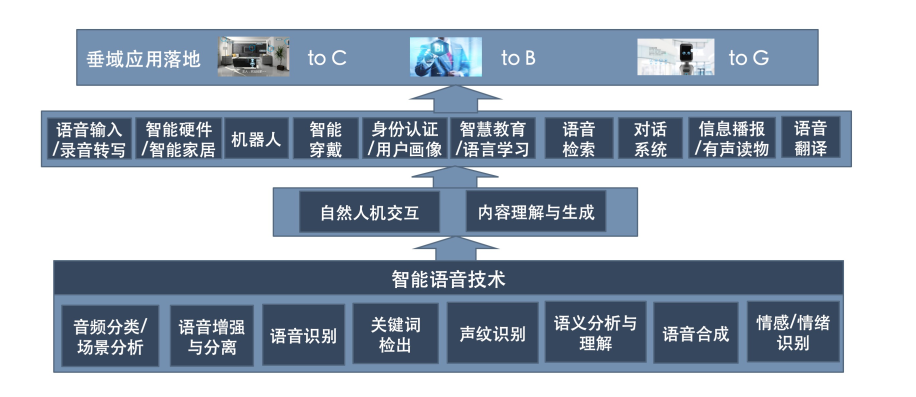

智能家居

智能车载：百度借助自己的人工智能生态平台，推出了智能行车助手CoDriver。科大讯飞与奇瑞等汽车制造商合作，推出了飞鱼汽车助理，推进车联网进程。搜狗与四维图新合作推出了飞歌导航。云知声、思必驰在导航、平视显示器等车载应用方面推出了多款智能语控车载产品。出门问问则基于自己的问问魔镜进入到智能车载市场。

智能客服机器人

AIoT入口

## 11. keyword spotting

- https://arxiv.org/pdf/2005.08347v3.pdf

更多参考：

- [Li, et al., ICASSP’19] Bo Li, Yu Zhang, Tara Sainath, Yonghui Wu, William Chan, Bytes are All You Need: End-to-End Multilingual Speech Recognition and Synthesis with Bytes, ICASSP 2019
- [Chiu, et al., ICASSP’18] Chung-Cheng Chiu, Tara N. Sainath, Yonghui Wu, Rohit Prabhavalkar, Patrick Nguyen, Zhifeng Chen, Anjuli Kannan, Ron J.
  Weiss, Kanishka Rao, Ekaterina Gonina, Navdeep Jaitly, Bo Li, Jan Chorowski, Michiel Bacchiani, State-of-the-art Speech Recognition With Sequence-to-Sequence Models, ICASSP, 2018
- [Huang, et al., arXiv’19] Hongzhao Huang, Fuchun Peng, An Empirical Study of  Efficient ASR Rescoring with Transformers, arXiv, 2019
- [Graves, et al., ICML’14] Alex Graves, Navdeep Jaitly, Towards end-to-end speech recognition with recurrent neural networks, ICML, 2014
- [Lu, et al., INTERSPEECH’15] Liang Lu, Xingxing Zhang, Kyunghyun Cho, Steve Renals, A Study of the Recurrent Neural Network Encoder-Decoder for Large Vocabulary Speech Recognition, INTERSPEECH, 2015
- [Soltau, et al., ICASSP’14] Hagen Soltau, George Saon, Tara N. Sainath, Joint training of convolutional and non-convolutional neural networks, ICASSP, 2014 
- [Sak, et al., INTERSPEECH’15] Haşim Sak, Andrew Senior, Kanishka Rao, Françoise Beaufays, Fast and Accurate Recurrent Neural Network Acoustic Models for Speech Recognition, INTERSPEECH, 2015
- [Rao, et al., ASRU’17] Kanishka Rao, Haşim Sak, Rohit Prabhavalkar, Exploring Architectures, Data and Units For Streaming End-to-End Speech Recognition with RNN-Transducer, ASRU. 2017
- [Bengio, et al., JMLR’03] Yoshua Bengio, Réjean Ducharme, Pascal Vincent, Christian Janvin, A neural probabilistic language model, The Journal of Machine Learning Research, March 2003
- [Mikolov, et al., INTERSPEECH’10] Tomáš Mikolov, Martin Karafiát, Lukáš Burget, Jan Černocký, Sanjeev Khudanpur, Recurrent Neural Network Based Language Model INTERSPEECH, 2010
- 不同种族：Racial disparities in automated speech recognition
- 口音：• Sining Sun, Ching-Feng Yeh, Mei-Yuh Hwang, Mari Ostendorf, Lei Xie,
  Domain Adversarial Training for Accented Speech Recognition,
  ICASSP2018
  • Ke Wang, Junbo Zhang, Yujun Wang, Lei Xie, Empirical Evaluation of
  Speaker Adaptation on DNN based Acoustic Model, Interspeech2018
- 信道和环境的可变性：Ke Wang, Junbo Zhang, Sining Sun, Yujun Wang, Fei Xiang, Lei Xie,
  "Investigating Generative Adversarial Networks based Speech
  Dereverberation for Robust Speech Recognition", Interspeech2018
- [1].End-to-End Speech Recognition Models
- [2].Deep Speech 2 : End-to-End Speech Recognition in English and Mandarin
- Attention-Based Models for Speech Recognition 
- 鸡尾酒效应：https://chimechallenge.github.io/chime6/  
- 远场语音识别：• T. N. Sainath et al., "Multichannel Signal Processing With Deep Neural Networks for Automatic Speech Recognition," in IEEE/ACM Transactions on Audio, Speech, and Language Processing, vol. 25, no. 5, pp. 965-979, May 2017
  • Minhua, Wu & Kumatani, Kenichi & Sundaram, Shiva & Strom, Nikko & Hoffmeister, Bjorn. (2019). Frequency Domain Multi-channel Acoustic Modeling for Distant Speech Recognition. 6640-6644
- A van den Oord et al (2018) “Representation learning with Contrastive Predictive Coding”. 
- S Schneider et al (2019). “wav2vec: unsupervised pre-training for speech recognition”. Interspeech. 
- A Baevski et al (2020). “VQ-wav2vec: self-supervised learning of discrete speech representations”. ICLR.
- A Baevski et al (2020). “wav2vec 2.0: A framework for self-supervised learning of speech representations. NeurIPS.
- A van den Oord et al (2016). “WaveNet: a generative model for raw audio”. 
- J Chorowski et al (2019). “Unsupervised speech representation learning using WaveNet autoencoders”. IEEE/ACM transactions on audio, speech and language processing.
- T Sainath et al. (2015). “Learning the speech front-end with raw waveform CLDNNs”. ISCA

### Multilingual and Low-Resource Speech Recognition:

- L Besaciera et al (2014). “Automatic speech recognition for under-resourced languages: A survey”, Speech Communication, 56:85–100. http://www.sciencedirect.com/science/article/pii/ S0167639313000988 
- Z T¨uske et al (2013). “Investigation on cross- and multilingual MLP features under matched and mismatched acoustical conditions”, ICASSP. http://ieeexplore.ieee.org/abstract/document/6639090/ 
- A Ghoshal et al (2013). “Multilingual training of deep neural networks”, ICASSP-2013. http://ieeexplore.ieee.org/abstract/document/6639084/
- J-T Huang et al (2013). “Cross-language knowledge transfer using multilingual deep neural network with shared hidden layers”, ICASSP. http://ieeexplore.ieee.org/abstract/document/6639081/. 
- M Gales et al (2015). “Unicode-based graphemic systems for limited resource languages”, ICASSP. http://ieeexplore.ieee.org/document/7178960/
- M Creutz et al (2007). “Morph-based speech recognition and modeling OOV words across languages”, ACM Trans Speech and Language Processing, 5(1). http://doi.acm.org/10.1145/1322391.1322394 
- A. Conneau, et al (2020). “Unsupervised cross-lingual representation learning for speech recognition”, arXiv:2006.13979. https://arxiv.org/abs/2006.13979 
- V. Manohar, et al. (2018) “Semi-supervised training of acoustic models using lattice-free MMI”. In Proc. IECC ICASSP (pp. 4844-4848). https://ieeexplore.ieee.org/abstract/document/8462331

> 深度学习仅用到了语音信号各个频带的能量信息，而忽略了语音信号的相位信息，尤其是对于多通道而言，如何让深度学习更好的利用相位信息可能是未来的一个方向。

> 以下为主要参考：
>
> - [资料参考](https://blog.csdn.net/weixin_41213648/article/details/96194425)
> - [数据集标记](https://github.com/makeplanetoheaven/NlpModel/tree/master/SpeechRecognition/Dataset)
> - [数据集参考](https://www.pianshen.com/article/8272677915/#_Toc21031024)
> - [经典书籍](《Speech and Language Processing: An introduction to natural language processing, computational linguistics, and speech recognition》)
> - [李宏毅ASR_ppt](http://speech.ee.ntu.edu.tw/~tlkagk/courses.html)
> - [B站台大语音识别](https://www.bilibili.com/video/BV1pE411B7Ja)
> - [stanford_ppt](http://web.stanford.edu/class/cs224s/syllabus/)
> - [stanford_tutorial](https://www.youtube.com/playlist?list=PL8FFE3F391203C98C)
> - https://www.inf.ed.ac.uk/teaching/courses/asr/lectures-2021.html
> - [参考博客1，大致介绍了语音的发展](https://zhuanlan.zhihu.com/p/82872145)
> - [参考系列博客2，主要是传统的信号处理](https://zhuanlan.zhihu.com/p/355622380)--> [github](https://github.com/musikalkemist/AudioSignalProcessingForM)
> - [参考系列博客3](https://blog.csdn.net/weixin_34255055/article/details/92394464)
> - [书籍推荐](https://mp.weixin.qq.com/s/i7JaDoU2L7uRYsw8FTR3jA)
> - [工具ASRT](https://mp.weixin.qq.com/s/VkKFQ0fOOHJw0p7Z4EDugQ)
> - [paper](https://github.com/zzw922cn/awesome-speech-recognition-speech-synthesis-papers)
> - 合成https://github.com/xcmyz/speech-synthesis-paper

https://arxiv.org/pdf/2010.13154v2.pdf

https://github.com/speechbrain/speechbrain/tree/develop/recipes/WSJ0Mix/separation

语音增强论文：https://zhuanlan.zhihu.com/p/99143394

https://github.com/chaoyueziji/SpeechEnhancement

https://www.bilibili.com/read/cv7110144

##############

在看：https://space.bilibili.com/627545197?spm_id_from=333.788.b_765f7570696e666f.1

https://www.bilibili.com/video/BV1B54y147nS?p=6

https://arxiv.org/abs/2101.11577

https://zhuanlan.zhihu.com/p/141956644

https://github.com/charlesliucn/awesome-end2end-speech-recognition

##############

https://paperswithcode.com/search?q_meta=&q=data+augmentation+method+for+speech+recognition

paper + 代码

https://github.com/eesungkim/Speech_Enhancement_DNN_NMF

语音识别6篇论文：https://blog.csdn.net/weixin_48294000/article/details/108373719

语音入门论文：https://blog.csdn.net/youyuyixiu/article/details/53764218

https://www.inf.ed.ac.uk/teaching/courses/asr/lectures-2021.html

Single headed attention based sequence-to-sequence model for state-of-the-art results on Switchboard

https://2020.ieeeicassp.org/

http://www.interspeech2020.org/

ASRU: IEEE Automatic Speech Recognition and Understanding

Deep Reinforcement Learning for Sequence-to-Sequence Models

Workshop

http://slt2020.org/

https://www.iscslp2021.org/

SPEECH EMOTION RECOGNITION WITH MULTISCALE AREA ATTENTION AND DATA AUGMENTATION

https://github.com/zliucr/coach

## Advancing Transformer Transducer for Speech Recognition on Large-Scale Dataset: Efficient Streaming and LM Adaptation

- Background: 

  - E2E based ASR models achieved great success
    - simplify ASR system by jointly optimizing AM, lexicon and LM
    - outperform traditional hybrid system in terms of WER
    - variants including LSA(a.k.a AED),CTC, RNN-T
  - Key factors for developing E2E ASR models in practice
    - accuracy
    - real-time
    - streamable
    - dinaub adaptation
    - custonization; time stamp; latency

- Model overview: Transformer Transducer

  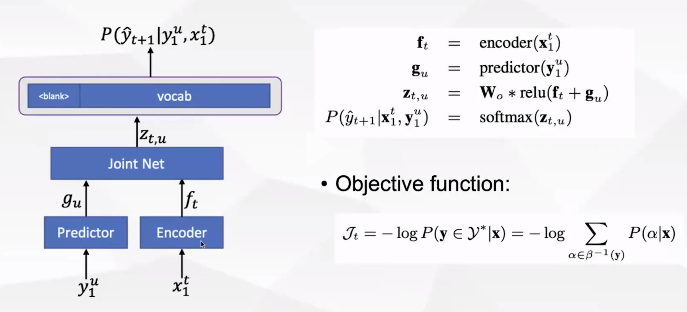

  - Neural Network Blocks

    - DNN
    - RNN
    - Transformer
    - Conformer

  - Streaming E2E ASR

    - CTC

    - Mocha

    - Trigger Attention

    - Transducer

      - Transducer is more robust and yields better accuracy on large-scale dataset

      - 问题：

        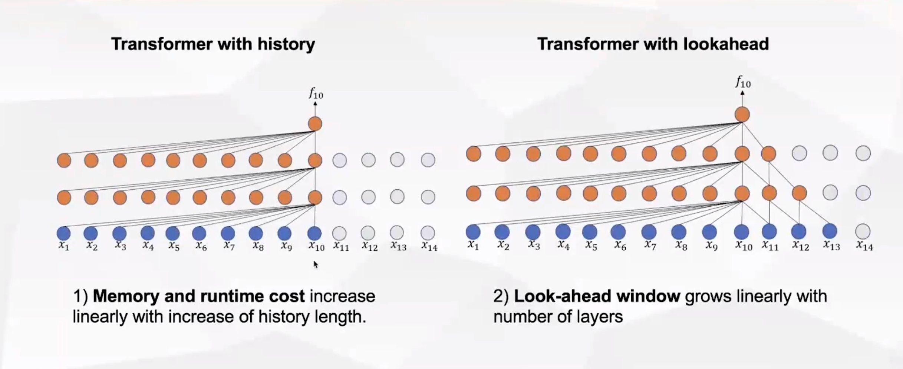

        - Transformer with history(attention): memory and runtime cost increase linearly with increase of history length
        - Transformer with lookshead: look-ahead window grows linearly with nember on layers
        - No explicit LM in neural Transducer model, An internal LM cound be extracted, but not work as standard LM
          - Existed solutions:
            - TTS based approach
            - Lm fusion with external LM, e.g. shallow fusion density ratio
            - Fast LM with regularization

- Efficient Streaming: Attention Mask is All You Need

  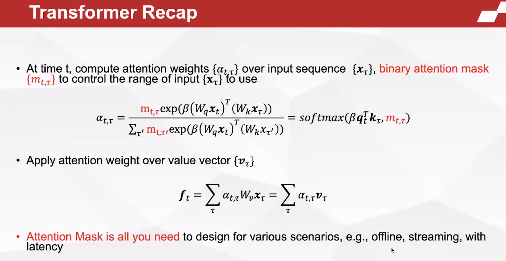

  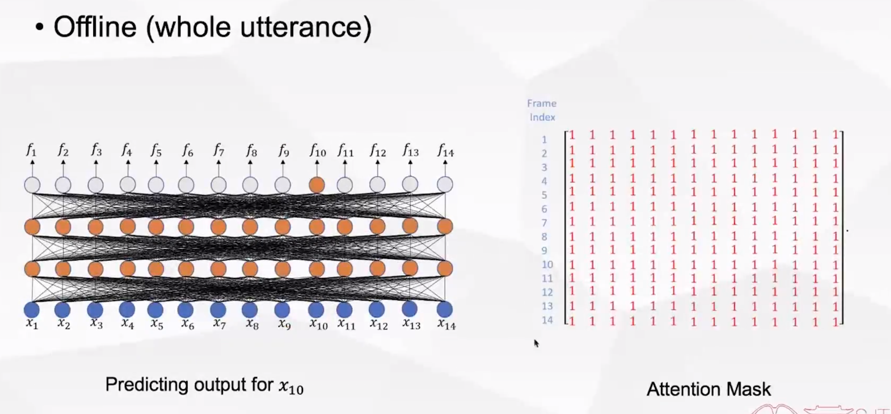

  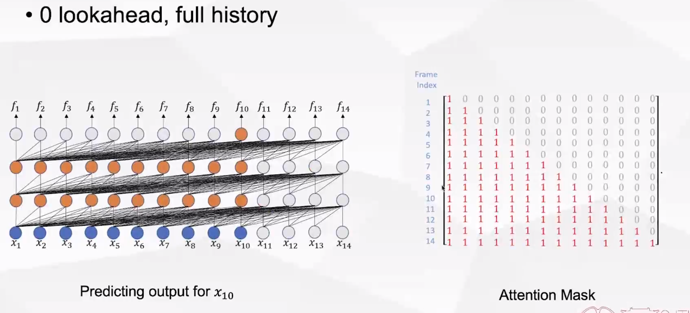

  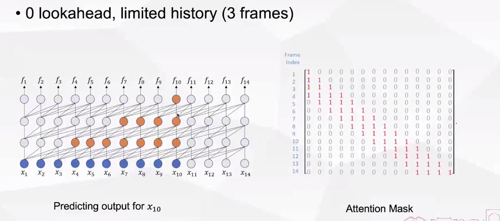

  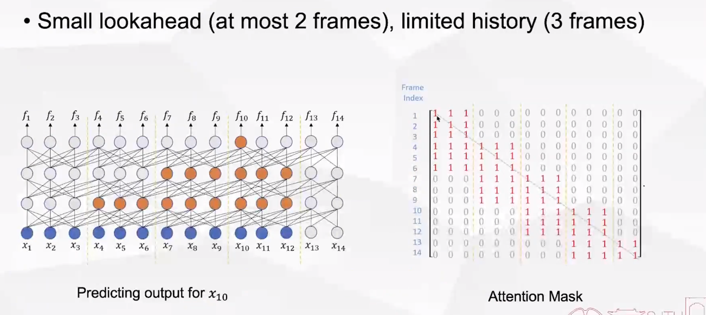

  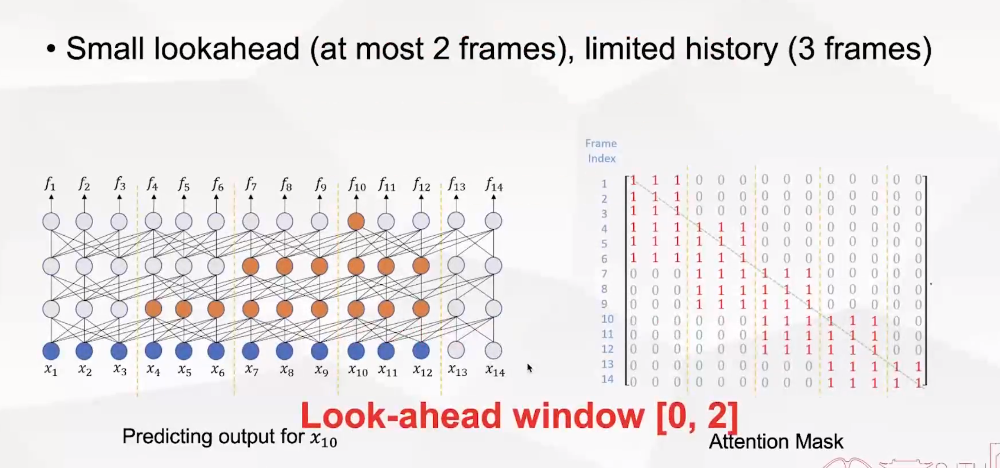

  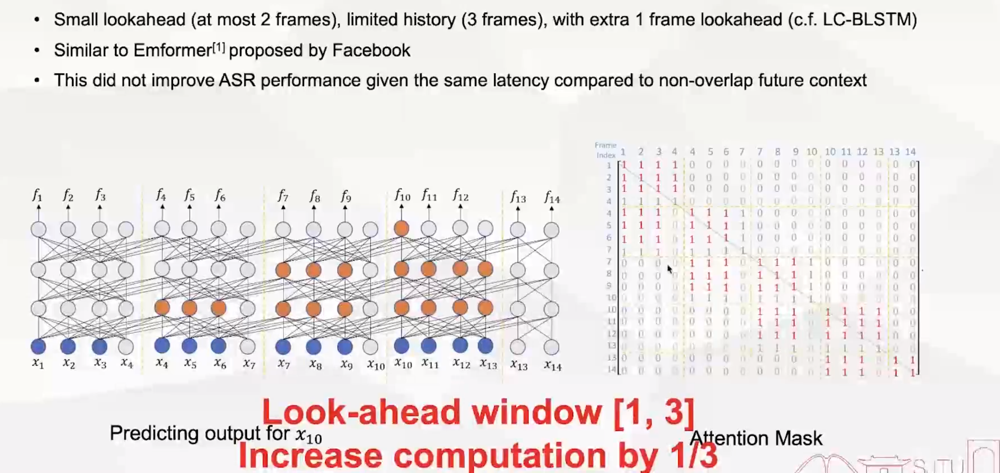

  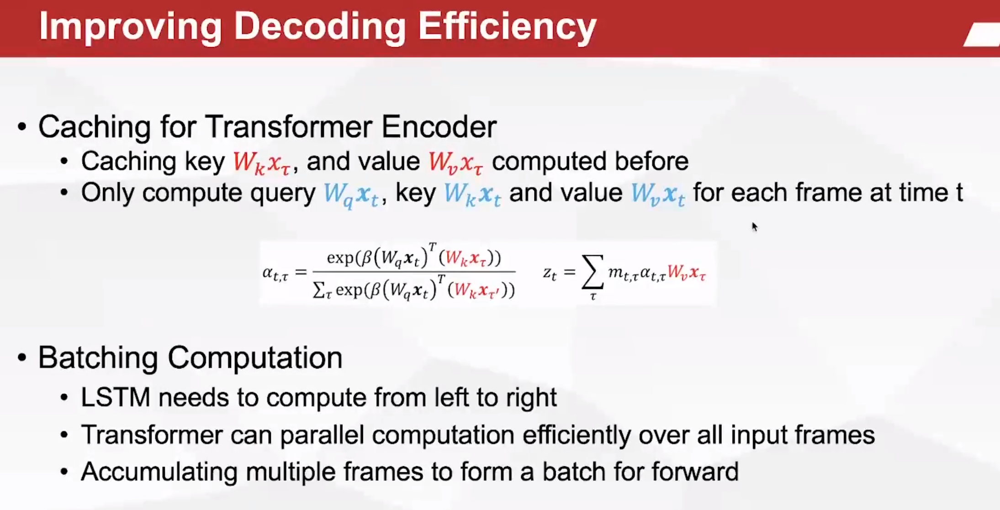

  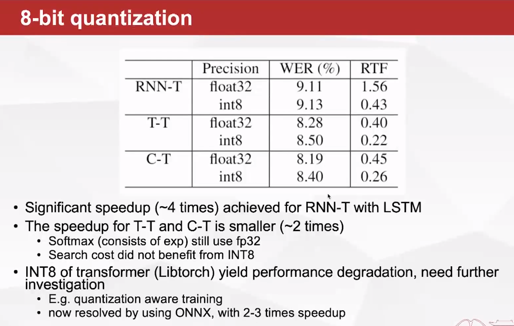

- Efficient LM Adaptation: Factorized Neural Transducer

  - TTS based approach
    - synthesize audio from target-domain text
    - finetune model using audio-text pair data
    - drawback: computationally expensize

  - External LM fusion

    - shallow fusion; density ration; ubternal LM estimation, and so on
    - log-linear interpolation between external LM and E2E models
    - drawback: sensitive to interpolation weight and need to tune on each test set

  - Fast LM addaptation

    - Treat the internal LM of E2E models as LM and finetune with the text-only data
    - drawback: various regularization; complicated training procedure; worse than shallow fusion interms of WER

    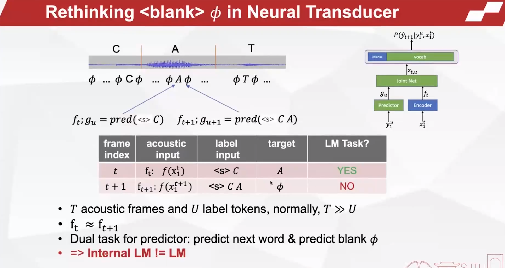

    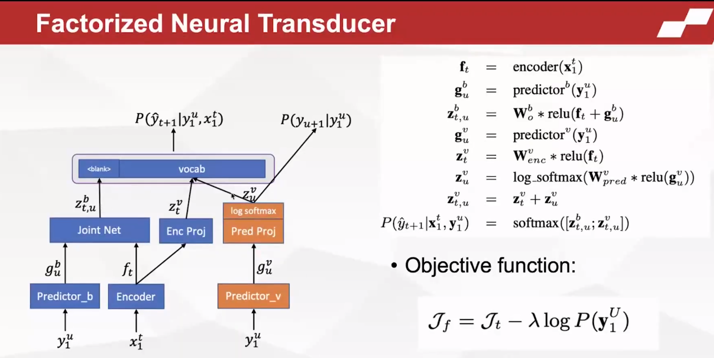

    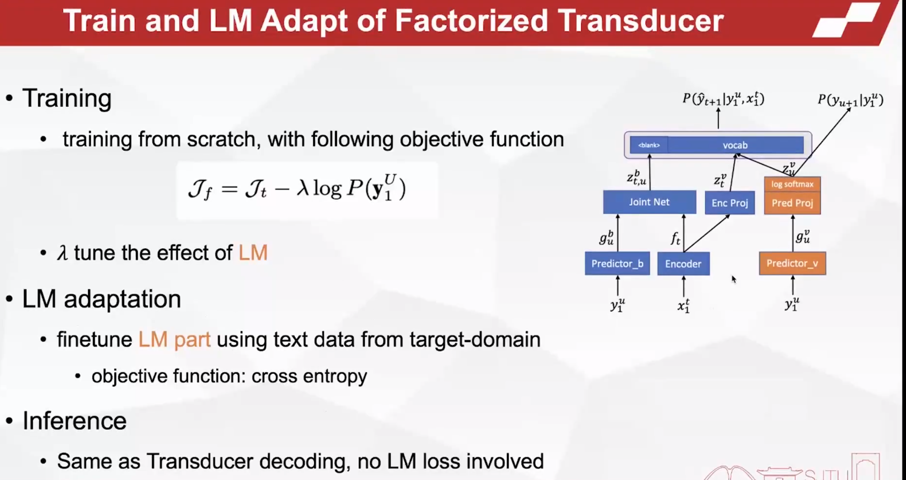

    

> 参考论文：
>
> - collaborative work with former colleagues in microsoft
> - Transformer Transducer: A Streamable Speech Recignition model with Transformer Encoders and RNN-T Loss
> - Conformer Transducer
> - Transformer-Transducer: End-to-End speech recognition with self-attention 
> - developing real-time streaming transformer transducer for speech recognition on large-scale dataset
> - Emformer
> - factirized neural transducer for efficient language model adaptation

## Speech Recognition Development: A Dataset and Benchmark Perspective

- modern: recent recordings
- lndusrty scale (10000+ hours)
- high-quality
- multi-domain
- permissive

> 参考：
>
> - The history of speech recognition to the year 2030