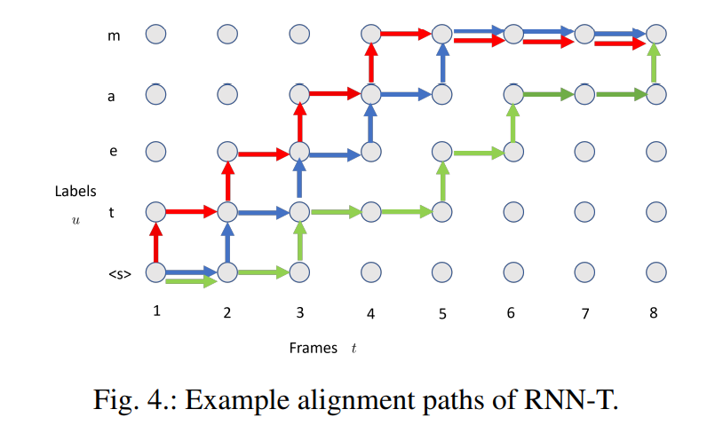
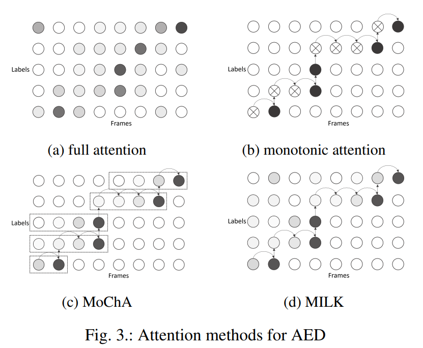
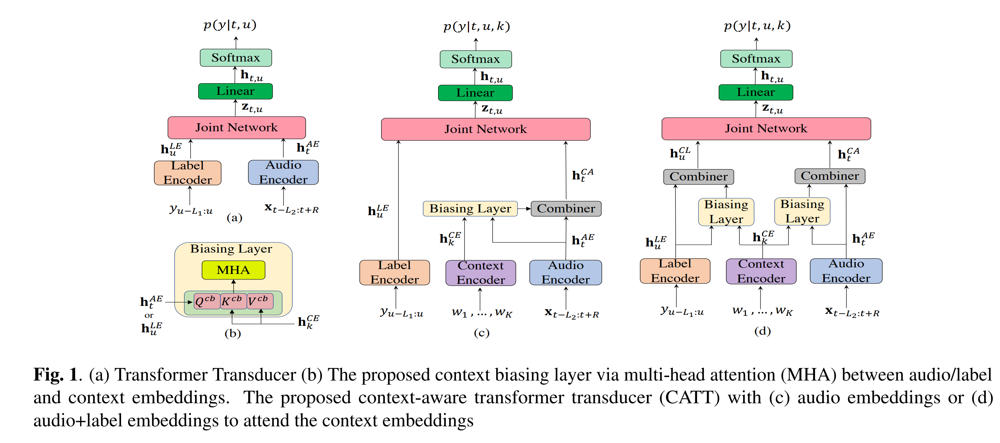

[zzw922cn/awesome-speech-recognition-speech-synthesis-papers: Automatic Speech Recognition (ASR), Speaker Verification, Speech Synthesis, Text-to-Speech (TTS), Language Modelling, Singing Voice Synthesis (SVS), Voice Conversion (VC) (github.com)](https://github.com/zzw922cn/awesome-speech-recognition-speech-synthesis-papers#Automatic-Speech-Recognition)

[The Top 98 Automatic Speech Recognition Open Source Projects on Github (awesomeopensource.com)](https://awesomeopensource.com/projects/automatic-speech-recognition)

## wenet-e2e

github/com/wenet-e2e

- motivation
  - 流式问题
  - 产品化问题：LM支持、Endpoint问题、时间戳、热词
  - 研究模型到产品模型转化的问题
- 面向产品级、工业级的端到端语音识别全栈式解决方案
  - 产品第一
  - 轻量级
  - 准确率高

## review and future

#### The History of Speech Recognition to the Year 2030 

#### Recent Advances in End-to-End Automatic Speech Recognition

相对于传统的混合模型的ASR，端到端E2E的ASR系统具备以下优点：

- 混合模型的每个模块优化都是单独优化，不能保证获取全局最优，而E2E的ASR使用一个优化函数来优化整个网络；
- E2E的ASR直接输出character或者words，简化流程；而混合模型的每个模块都需要相应的专业知识；
- 相对于混合模型，e2e模型使用一个网络进行识别，整个系统更加紧凑，可以更便捷在设备上部署。

虽然端到端的ASR具备以上优点，而且在很多benchmarks超过混合模型，但混合模型在工业界依然占据主要市场。混合模型在工业界发展数十年，在streaming,latency,adaptation capability,accuracy等方面的方案技术有较厚的积累，e2e的asr要想替代混合模型，必须在以上诸多方面超越混合模型。

本文为了促进e2e的asr方案落地，从工业界的角度对近年来的e2e的方案进行总结，更好的应对以上的挑战。

##### end-to-end ASR

- CTC (connectionist temporak classification)
- AED (attention-based Encoder-Decoder)
  - 其为了实现streaming方式，需要对attention进行处理,**Fig 3**
- RNN-T (Recurrent Neural Network Transducer)

##### Encoder

- LSTM
- Transformer
  - 为了实现streaming ASR，需要在attention使用mask策略，使其只看到部分的context。图6展示了不同的attenion及对应的mask矩阵。

##### training criterion

-  teacher-student learning
- Minimum Word Error Rate Traing

##### 多语言模型以及方案

介绍了使用语言ID（LID)的优劣和CMM方案，以及code-switching在句内和句间的挑战。

##### adaptation

- speaker adaptation
- domain adaptation
- Customization --> CLSA

#####  Advanced Models

- Non-Autoregressive Models

  - 自回归（AutoRegressive, AR）模型又称为时间序列模型
  - 不同于自回归(Autoregressive Translation , ART)模型需要用已生成的词来预测下一个位置的词，非自回归 (Non-Autoregressive Translation, NART)模型打破了生成时的串行顺序，希望一次能够解码出整个目标句子，从而解决AT模型所带来的问题。

  

  > Streaming End-to-End ASR based on Blockwise Non-Autoregressive Models

- Unified Models, 流式和非流式方案的结合，动态计算等等

  

- Two-pass Models

  

- Multi-talker Models

- Multi-channel Models

##### more

- 更多语音的toolkits
- 系统使用的建模单元：characters,word-piece,words
- limited data，data augmentation, self-supervised
- 模型部署的研究，模型压缩，量化等等
- asr模型的输入直接使用waveform而不是声学特征
- 鲁棒性的研究

## Awesome Contextualization of E2E ASR

问题提出：对于产品级的自动语音识别（Automatic Speech Recognition, ASR）,能够适应专有领域的语境偏移（contextual bias），是一个很重要的功能。举个例子，对于手机上的ASR，系统要能准确识别出用户说的app的名字，联系人的名字等等，而不是发音相同的其他词。更具体一点，比如读作“Yao Ming”的这个词语，在体育领域可能是我们家喻户晓的运动员“姚明”，但是在手机上，它可能是我们通讯录里面一个叫做“姚敏”的朋友。如何随着应用领域的变化，解决这种偏差问题就是我们这个系列的文章要探索的主要问题。

对于传统的ASR系统，它们往往有独立的声学模型（AM）、发音词典（PM）、以及语言模型（LM），当需要对特定领域进行偏移时，可以通过特定语境的语言模型LM来偏移识别的过程。但是对于端到端的模型，AM、PM、以及LM被整合成了一个神经网络模型。此时，语境偏移对于端到端的模型十分具有挑战性，其中的原因主要有以下几个方面：

- 端到端模型只在解码时用到了文本信息，作为对比，传统的ASR系统中的LM可以使用大量的文本进行训练。因此，我们发现端到端的模型在识别稀有、语境依赖的单词和短语，比如名词短语时，相较于传统模型，更容易出错。
- 端到端的模型考虑到解码效率，通常在beam search解码时的每一步只保有少量的候选词（一般为4到10个词），因此，稀有的单词短语，比如依赖语境的n-gram（n元词组），很有可能不在beam中。

**Shallow fusion (浅融合)：**将独立训练的语境n-gram 语言模型融入到端到端模型中，来解决语境建模的问题。将端到端的输出得分与一个外部训练的语言LM得分在beam search时进行融合：

- 但是他们的方法对于专有名词处理得比较差，专有名词通常在beam search时就已经被剪裁掉了，因此即使加入语言模型来做偏移，也为时已晚。
- 因为这种偏移通常在每个word生成后才进行偏移，而beam search在grapheme/wordpiece （对于英文来说，grapheme指的是26个英文字母+1空格+12常用标点。对于中文来说，grapheme指的是3755一级汉字+3008二级汉字+16标点符号） 等sub-word单元上进行预测。

#### Shallow-Fusion End-to-End Contextual Biasing

- 首先，为了避免还没使用语言模型进行偏移，专有名词就被剪枝掉了，我们探索在sub-word单元上进行偏移。
- 其次，我们探索在beam 剪枝前使用contextual FST。
- 第三，因为语境n-gram通常和一组共同前缀(“call”, “paly”)一起使用，我们也去探索在shallow fusion时融合这些前缀
- 最后，为了帮助专有名词的建模，我们探索了多种技术去利用大规模的文本数据。无监督（NER）+有监督，合成的语音+加噪的语音

偏移的级别：

- 对grapheme进行偏移
- 对wordpiece进行偏移

> Subword算法：[深入理解NLP Subword算法：BPE、WordPiece、ULM - 知乎 (zhihu.com)](https://zhuanlan.zhihu.com/p/86965595)
>
> - 可用sentencepiece库

> Google, 2019

### Contextual LAS (CLAS)

#### Deep context

end-to-end contextual speech recognition

在ASR中，一个用户说话的内容取决于他所处的上下文，通常这种上下文可以由一系列的n-gram单词所代表。在ASR中，一个用户说话的内容取决于他所处的上下文，通常这种上下文可以由一系列的n-gram单词所代表。

我们的方法是首先将每个短语映射成固定维度的词嵌入，然后采用一个attention注意力机制在模型输出预测的每一步去摘要可用的上下文信息。我们的方法可以被看成是流式关键词发现技术[3]的一个泛化，即允许在推理时使用可变数量的上下文短语。我们提出的模型在训练的时候不需要特定的上下文信息，并且也不需要对重打分的权重进行仔细的调整，仍然能融入OOV词汇。

#### EESEN

END-TO-END SPEECH RECOGNITION USING DEEP RNN MODELS AND WFST-BASED DECODING

在这个工作中，声学模型的建模是利用RNN去预测上下文无关的音素或者字符，然后使用CTC去对齐语音和label。

这篇文章与众不同的一个点是基于WFST提出了一种通用的解码方法，可以在CTC解码的时候融入词典和语言模型。CTC labels、词典、以及语言模型被编码到一个WFST中，然后合成一个综合的搜索图。这种基于WFST的方式可以很方便地处理CTC里的blank标签和进行beam search。

解码速度大大加快了。这种加速来源于状态数量的大幅减少。

#### Contextual speech recognition

Contextual speech recognition with difficult negative training examples

The main idea is to focus on proper nouns (e.g., unique entities such as names of people and places) in the reference transcript, and use phonetically similar phrases as negative examples, encouraging the neural model to learn more discriminative representations.

> [stevenhillis/awesome-asr-contextualization: A curated list of awesome papers on contextualizing E2E ASR outputs (github.com)](https://github.com/stevenhillis/awesome-asr-contextualization)
>
> [语境偏移如何解决？专有领域端到端ASR之路（一）-云社区-华为云 (huaweicloud.com)](https://bbs.huaweicloud.com/blogs/269842)
>
> [tensorflow/lingvo: Lingvo (github.com)](https://github.com/tensorflow/lingvo)

#### Phoebe

pronunciation-aware contextualization for end-to-end speech recognition

传统的ASR系统使用字典的方式使得这个系统对于未知的稀有词汇有更好的适应性；但是端到端的ASR系统对于稀有词汇的适用性较差。

Unlike CLAS, which accepts only the textual form of the bias phrases, the proposed model also has access to the corresponding phonetic pronunciations, which improves performance on challenging sets which include words unseen in training.

#### Phoneme-Based 

Phoneme-Based Contextualization for Cross-Lingual Speech Recognition in End-to-End Models

 The problem is exacerbated when biasing towards proper nouns in foreign languages, e.g., geographic location names, which are virtually unseen in training and are thus out-of-vocabulary (OOV). 

While grapheme or wordpiece E2E models might have a difficult time spelling OOV words, phonemes are more acoustically salient and past work has shown that E2E phoneme models can better predict such words.

#### Joint Grapheme and Phoneme Embeddings for Contextual End-to-End ASR,facebook

In this work, we improve the CLAS approach by proposing several new strategies to extract embeddings for the contextual entities. We compare these embedding extractors based on graphemic and phonetic input and/or output sequences and show that an encoder-decoder model trained jointly towards graphemes and phonemes out-performs other approaches

#### Tree-constrained Pointer Generator for End-to-end Contextual Speech Recognition

### Contextual Transducer ("RNNTs")

#### CONTEXTUAL RNN-T FOR OPEN DOMAIN ASR

While this has some nice advantages, it limits the system to be trained using only paired audio and text. Because of this, E2E models tend to have difficulties with correctly recognizing rare words that are not frequently seen during training, such as entity names. 

we propose modifications to the RNN-T model that allow the model to utilize additional metadata text with the objective of improving performance on these named entity words.

#### MultiState encoding with end-to-end speech rnn transducer network

In this paper, we propose a technique for incorporating contextual signals, such as intelligent assistant device state or dialog state, directly into RNN-T models.

#### DEEP SHALLOW FUSION FOR RNN-T PERSONALIZATION

In this work, we present novel techniques to improve RNN-T’s ability to model rare WordPieces, infuse extra information into the encoder, enable the use of alternative graphemic pronunciations, and perform deep fusion with personalized language models for more robust biasing. 

#### Contextualized Streaming End-to-End Speech Recognition with Trie-Based Deep Biasing and Shallow Fusion

We address these limitations by proposing a novel solution that combines shallow fusion, trie-based deep biasing, and neural network language model contextualization.

#### CONTEXT-AWARE TRANSFORMER TRANSDUCER FOR SPEECH RECOGNITION

Specifically, we propose a multi-head attention-based context-biasing network, which is jointly trained with the rest of the ASR sub-networks. 

We explore different techniques to encode contextual data and to create the final attention context vectors. 

We also leverage both BLSTM and pretrained BERT based models to encode contextual data and guide the network training.

### on-device

#### FAST CONTEXTUAL ADAPTATION WITH NEURAL ASSOCIATIVE MEMORY FOR ON-DEVICE PERSONALIZED SPEECH RECOGNITION 

fast contextual adaptation has shown to be effective in improving Automatic Speech Recognition (ASR) of rare words and when combined with an on-device personalized training, it can yield an even better recognition result. However, the traditional re-scoring approaches based on an external language model is prone to diverge during the personalized training. In this work, we introduce a model-based end-to-end contextual adaptation approach that is decoder-agnostic and amenable to on-device personalization

## Training Label Error

#### Investigation of Training Label Error Impact on RNN-T

数据标注错误对RNN-T影响Training Label Error Impact on RNNT

训练数据的标注错误对模型性能表现影响程度的研究在图像领域较多，在识别领域的研究较少。识别领域的训练数据标注错误主要分为三类：deletion ， insertion 和substitution。在GMM-HMM模型时代，数据的insertion错误对声学模型影响较大。本文主要研究以上三种错误对端到端的语音识别模型RNN-T的影响程度以及各种减缓错误的影响策略。

缓解标注错误的通常策略

   a) data based: 数据清洗data filtering or selection  

​    b) model capacity based: 增大模型参数量 increase model or data size

   c) optimization processs based: regularization(dropout, specaugment)

## datasets

#### Towards Measuring Fairness in Speech Recognition: Casual Conversations Dataset Transcriptions

开源一个带诸多metadata属性(性别，年龄，肤色等等）的闲聊Casual Conversations语音测试集，并使用该测试集对ASR系统进行fairness评估，发掘更多影响ASR效果的诸多因素，为开发更加鲁棒的ASR系统做贡献

#### The People's Speech: A Large-Scale Diverse English Speech Recognition Dataset for Commercial Usage

开源30000小时的英文ASR语料，该语料是可以商用的

#### AliMeeting

> https://github.com/yafan-aslp/AiMeeting

#### GigaSpeech

#### WenetSpeech

## Streaming

#### A comparison of streaming models and data augmentation methods for robust speech recognition

对比端到端流式ASR系统Monotonic Chunkwise Attention (MoChA) 和 Recurrent Neural Network-Transducer (RNN-T)的性能以及multi-conditioned training using an acoustic simulator, Vocal Tract Length Perturbation (VTLP) for speaker variability, and SpecAugment等数据增广对比试验，主要为经验分享

## on-device

#### How to make on-device speech recognition practical

- [How to make on-device speech recognition practical - Amazon Science](https://www.amazon.science/blog/how-to-make-on-device-speech-recognition-practical)

#### Tied & Reduced RNN-T Decoder

优化RNN-T的decoder的大小。

#### Dyn-ASR

Compact, Multilingual Speech Recognition via Spoken Language and Accent Identification

研究如何在边缘设备上进行多语言ASR的部署。在边缘设备上部署多语言ASR是一件具有挑战的任务，因为边缘设备提供的计算资源和存储资源受到极大的限制。现在的终端设备提供的ASR服务更多采用云服务的方式，这种类型的服务的latency相对较大一些。本文设计一种在边缘设备上部署多语言ASR的架构：Dyn-ASR，该架构不仅性能表现优异，而且资源开销较小。

方法：先对wav文件进行预处理，然后通过language和accent模块进行语言和方言类型的识别，然后通过<language id, accent id>来选择相对应的识别模型进行加载和推理。其中<language id, accent id>对应的模型是在预训练模型上进行的微调，这样可以提高准确率。

## CTC

#### Why does CTC result in peaky behavior

- we prove that a feed-forward neural network trained with CTC from uniform initialization converges towards peaky behavior with a 100% error rate.

## LM

#### Adapting GPT, GPT-2 and BERT Language Models for Speech Recognition

预训练模型的Bert, GPT,GPT2为下游诸多nlp任务提供很好的帮助，但其在ASR中应用却很少研究，因此本文主要研究这些预训练模型Bert, GPT,GPT2在ASR中的应用。

## Augment data

#### VOICE CONVERSION CAN IMPROVE ASR IN VERY LOW-RESOURCE SETTINGS

- voice conversion (VC) has been proposed to improve speech recognition systems in low-resource languages by using it to augment limited training data.

## Pretraing model

#### UNSUPERVISED CROSS-LINGUAL REPRESENTATION LEARNING FOR SPEECH RECOGNITION

- multi-language
- wav2vec 2.0

#### A COMPARATIVE STUDY ON TRANSFORMER VS RNN IN SPEECH APPLICATIONS

- experiment

## Metric

#### Comparison of Subword Segmentation Methods for Open-vocabulary ASR using a Difficulty Metric

- bpe, char, and word

#### Syllable-Based Sequence-to-Sequence Speech Recognition with the Transformer in Mandarin Chinese

- CI-phonemes vs Syllables

> [gentaiscool/end2end-asr-pytorch: End-to-End Automatic Speech Recognition on PyTorch (github.com)](https://github.com/gentaiscool/end2end-asr-pytorch)

## cantonese asr

#### code

- kaldi: [manestay/cantonese-asr-kaldi: kaldi repo for cantonese-sr (github.com)](https://github.com/manestay/cantonese-asr-kaldi)

> dataset:  AISHELL-2 for Mandarin and BABEL for Cantonese.

- tensorflow: [kathykyt/cantonese_ASR: https://windfat.com (github.com)](https://github.com/kathykyt/cantonese_ASR)

- pre-training: [jonatasgrosman/wav2vec2-large-xlsr-53-chinese-zh-cn · Hugging Face](https://huggingface.co/jonatasgrosman/wav2vec2-large-xlsr-53-chinese-zh-cn)[chutaklee/CantoASR: Fine-tuning Wav2Vec2.0 on Common Voice(zh-HK) (github.com)](https://github.com/chutaklee/CantoASR)
- [fairseq/examples/wav2vec/unsupervised at main · pytorch/fairseq (github.com)](https://github.com/pytorch/fairseq/tree/main/examples/wav2vec/unsupervised)

> dataset: commonvoice_HK
>
> [Wav2vec 2.0: Learning the structure of speech from raw audio (facebook.com)](https://ai.facebook.com/blog/wav2vec-20-learning-the-structure-of-speech-from-raw-audio/)

- some package
  - [scottykwok/cantonese-selfish-project: Cantonese Selfish Project 廣東話自肥企劃 at PYCON HK 2021 (github.com)](https://github.com/scottykwok/cantonese-selfish-project/)

## Non-Autoregressive

#### Streaming End-to-End ASR based on Blockwise Non-Autoregressive Models

非自回归的模型受到极大的关注，尤其在rtf的优势，但其结果往往弱于自回归模型。本文结合mask-ctc和blockwise-attention,提出新的streming e2e asr，其结果相比于mask-ctc,其错误率更低。

图1为本文的详细设计，我们先看一下整体流程。输入的audio先进行block的划分，按照以往经验，block的边缘部分常会出现插入和删除错误，因此本文设计block之间存在50%的重叠部分，即每一帧被处理两遍。每个block数据经过blockwise-attention encoder处理后（每次处理都看到前一个block和当前block内容）使用greedy算法进行处理，对于重叠部分的处理本文采用算法1所示的dynamic map。接下来对预测的token输入到被称为masked language model(MLM)，该模型对dynamic mapping的结果具有较低的confidence的token进行重新预测，经过多轮调整输出最终的结果。训练函数为公式3所示。

## 多模态语音识别

#### Attention-based Audio-Visual Fusion for Robust Automatic Speech Recognition

- an audio-visual fusion strategy 

> dataset: TCD-TIMIT
>
> code: [georgesterpu/avsr-tf1: Audio-Visual Speech Recognition using Sequence to Sequence Models (github.com)](https://github.com/georgesterpu/avsr-tf1)

## OpenASR20

amharic、cantonese、guarani。。。

#### AUTOMATIC SPEECH RECOGNITION FOR LOW-RESOURCE LANGUAGES: THE THUEE SYSTEMS FOR THE IARPA OPENASR20 EVALUATION

针对低资源、小语种

> [Automatic Speech Recognition for Low-resource Languages and Accents Using Multilingual and Crosslingual Information (d-nb.info)](https://d-nb.info/1051848229/34)

## zero shot learning

#### Scaling ASR Improves Zero and Few Shot Learning

工具：

- [hirofumi0810/neural_sp: End-to-end ASR/LM implementation with PyTorch (github.com)](https://github.com/hirofumi0810/neural_sp)

声音成分分析任务

- 音频场景分类 ASC
- 音频标记 AI
- 声音事件检测 SED/AED
  - 异常声音检测，学习正常的压缩-重构，提取正常样本的本质特征。利用“易于重构正常样本，难以重构异常样本”的特性来检测异常样本
  - 
- 基于SED的声音分离

说话人识别：怎么处理混合语音

- 把传统的VAD变成Target-speaker VAD based post processing

  > The DKU-DUke-lenovo system description for the Thrid DIHARD Speech diarization challenge
  >
  > segment-level speaker embedding similarity measurement in speaker diarization
  >
  > online speaker diarization with graph-based label generation