1 review ACPR2021 Tutorial State-of-the-Art of End-to-End Speech Recognition  -- THU

- 传统的语音识别
- 基于端到端的语音识别
- 解释了通用的两个问题：label bias，exposure bias
- Data-efficient  -->  **CTC-CRF**
- Neural architecture
- JoinAp

2 自动字幕识别效果优化实践于探索 --  快手

- 字幕发展历程与趋势
  - 民间字幕组：美剧爆发、手工字幕组诞生
  - 手机AI字幕：手机厂商AI字幕识别
  - APP自动字幕：短视频时代的智能功能
    - 娱乐化与潮流化
    - 新生事物层出不穷
    - 字幕互译需求变大
- 自动字幕介绍
  - 优点：
    - 操作简单，一键触发
    - 准确率高，用于基于0编辑
    - 功能多样，支持卡拉ok字幕，字幕花字特效等
    - AI转换，速度快
    - 跨平台
- 自动字幕效果优化
  - 可用、效果、性能、用户体验
  - 识别准确率，网络延迟
  - 算法指标
    - 断句效果、WER、CER、RTF、性能、CPU、耗时、内存、并发数
  - 智能分析
    - 数据自动生产周期
      - 获取数据、爬虫
      - 打标签、标注：类别
      - 分类存储
      - 识别、打标签：情绪、词性、识别
      - 二次存储、修正
      - 数据管理平台
  - 用户画像
    - 机型、用户年龄、性别、城市分布、作品内容分类、作品时长（用聚类进行查看）
  - 实时热点
- 启发建议

3 2021 SpeechHome 语音技术研讨会

- 框架：
  - wenet
  - kaldi
- 内容
  - 语音识别
  - 音视频语音识别
  - 说话人识别
  - 语音增强

4 实时语音场景下的智能对话 -阿里

- 语音对话机器人

  - 分为两种：主动和被动，一个是由机器人来承接用户通过电话渠道拨到平台的热线服务；另一个是平台在某些场景下面主动通过电话触达到用户，来进行语音的对话。
  - 不论是呼入（由用户主动打电话到平台），还是呼出（由平台对用户进行触达），理论上其核心都是语音与对话的技术。其中技术团队的主要工作是优化语音与对话的体验：一方面对用户的理解越来越准确，另一方面提供尽量顺畅的交互能力，最终达成好的交互体验和业务效果。以上是实时语音场景下智能对话的整体背景。

  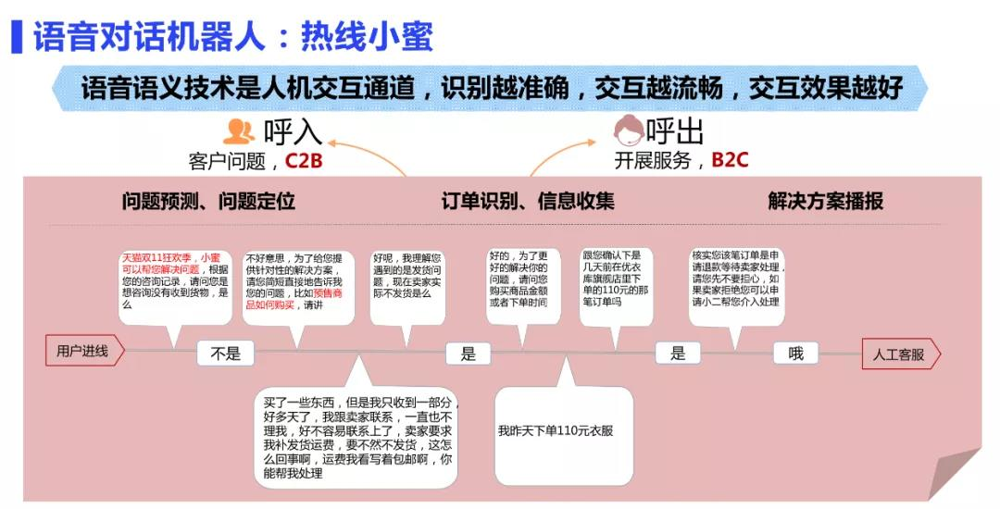

- 实时语音对话的挑战

  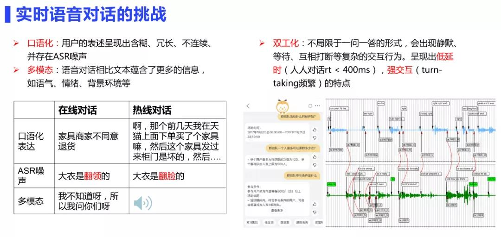

  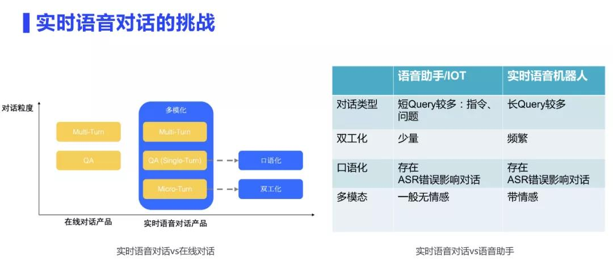

  - 口语化：相对于传统的基于IM的在线对话，用户在语音对话中，辉呈现冗长的、不连续的、带有ASR噪声的表述。在线对话可能就是简单的五六个字，十个字以内；热线对话，会有啰嗦的、讲故事的情况；
  - 多模态：语音对话中包含声音，天然具有比文本更丰富的信息。在线对话中仅表达了文本本身的意思。这段文本看起来好像是个问句，在热线电话的音频中虽然文本信息一致，但是从声音角度来讲，明显能够听到用户中间蕴含的一些语气以及和情绪相关的信息。
  - 双工化：低延时和强交互

- 对话：从文本驱动到语音语义驱动

  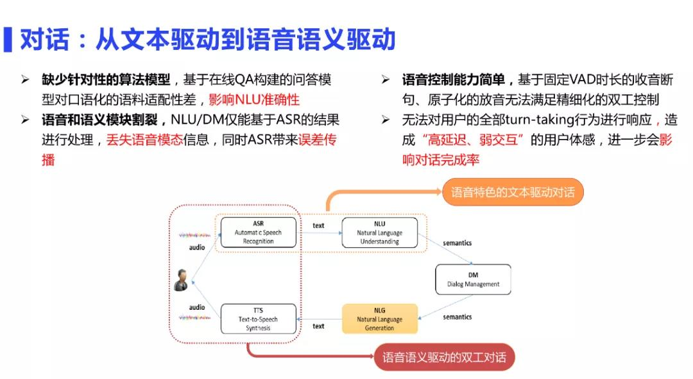

  - 针对以上问题，对话的核心工作主要围绕两个部分展开：
    - ASR和NLU：语音特色的文本驱动对话
    - ASR和TTD：语音语义驱动 的双工对话

- 语音特色的文本驱动对话

  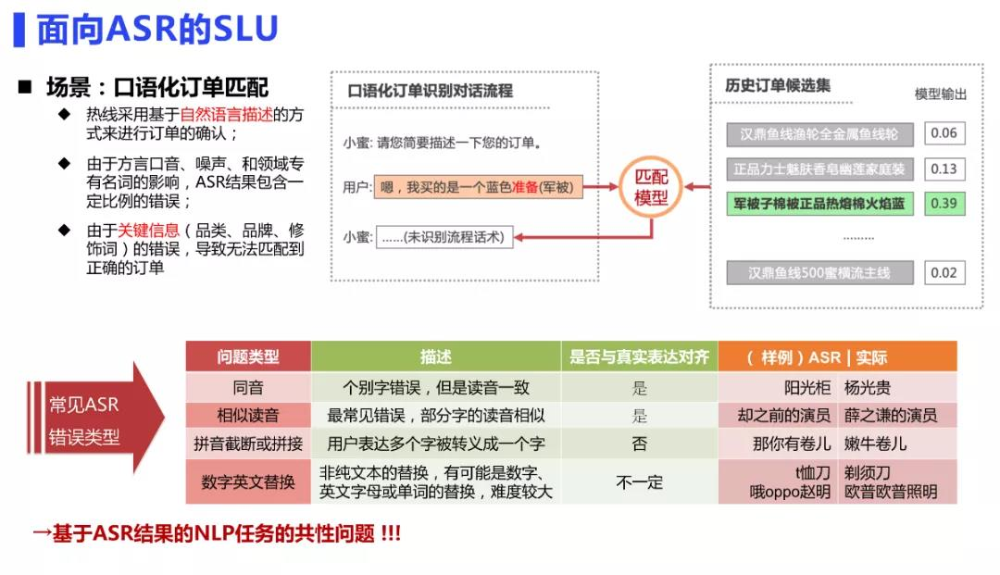

  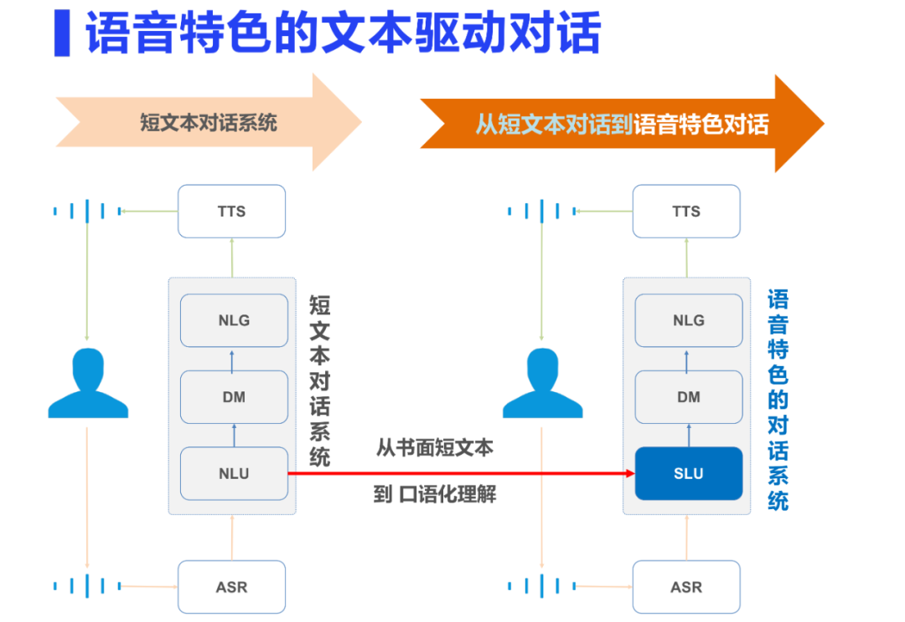

  - 大部分的语音对话机器人都是基于ASR结果对下游进行语义理解的任务。上图展示了实际业务中的一个场景：将用户的一句描述匹配到他的订单中，并且需要利用这个订单信息在其咨询过程中做一些下游工作。此时发现用户可能因为口音或ASR噪声，把“军被”翻译成了“准备”，这个关键词的ASR错误会导致无法匹配正确的候选订单。

    表中列出了4种类型的ASR错误：同音、相似读音、拼音截断或拼接、数字英文转换。这四种类型的错误几乎会发生在所有的基于ASR结果的NLP任务中，是一个共性问题。

    针对ASR结果的共性问题，传统方案是“纠错+SLU”：通过纠错模型把有错误的ASR文本改成正确的，再进入SLU模型得到最终结果。但这个方案存在一些缺陷：第一个是纠错任务难，需要在GroundTruth的Vocabulary里找到一个唯一正确的词进行填充。但是下游的SLU模型任务本身可能不难，比如意图分类模型可能就是几个或十几个意图的一个分类任务，或者像刚才案例中的订单匹配任务，相对来说比纠错任务的决策空间要小。故这种方式虽然可行，但它是用一个更难的事情来解决一个相对来说更容易的事情，成本是比较高的。由此提出另外一种思路：基于错误的过程直接映射到正确的结果，即SLU容错。

  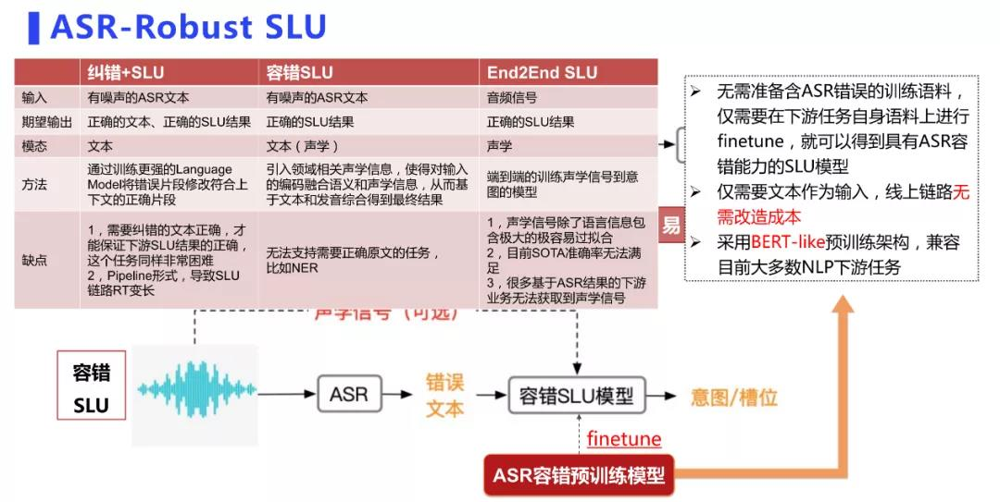

  - 上图表格中对比了三种方案（纠错SLU、容错SLU、端到端SLU）的优劣。其中端到端SLU（End2End SLU）在学术界做的比较多，工业界目前使用不是那么普遍。端到端SLU是用音频信号直接理解到最终的结果。端到端SLU是可行的，但目前在学术界没有得到和基于SLU pipeline模式的可比效果。核心原因在于：一方面音频信号比较容易过拟合，目前没有好的解决方案；另外一方面是现有的大量对话系统已经处于ASR的下游任务中，对ASR是黑盒调用状态，不见得在链路上能够拿到声学信号。综上所述，有必要做一个基于文本，有一定ASR容错能力的模型。

    故构建了一个具有容错能力的预训练模型，它可以同时encode一段文本的发音信息和语义信息。在某些字有错误的情况下，由于模型同时包含了语音、语义信息，使其具有一定的容错能力。通过这样的模型，仅需要在下游任务自身语料上进行fine-tuning，就能得到具有ASR容错能力的SLU模型。以上即是ARS-Robust 预训练模型的基本思路。

  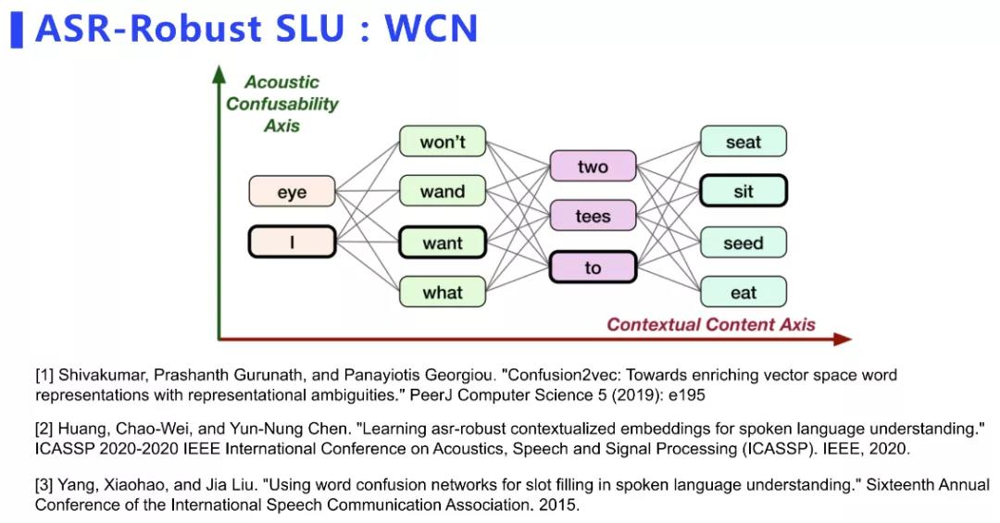

  - 上图展示了已发表的相关工作，如之前的主流方案是WCN。WCN是ASR的中间结果，即ASR中间的indexes，它会将ASR输出的indexes结果网络直接进行编码，而不是对Top-One的结果进行编码。这样的encoding方式既能够得到输出表示，又能够同时包含更丰富的上下文。WCN方案的问题在于需要拿到indexes输出，但是对于黑盒ASR的下游任务，如果拿不到indexes输出，模型就无法使用。

- 语音情绪检测

  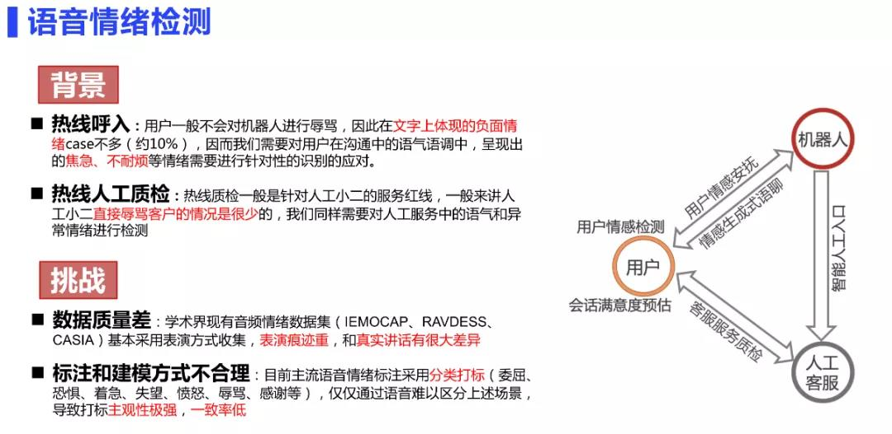

  - 语音检测的主要挑战并不是在建模上，而是数据质量差，标注、建模方式不合理。目前调研到的所有学术界的音频数据集质量都无法在工业界直接使用（与数据集的构成方式有关）。学术界现有音频情绪数据集基本采用表演方式构造，即由演员通过给定的条件来表演一段相关的音频，这与真实情况有较大差异。目前标注方式主要采用分类标注的方式，如委屈、恐惧、着急、失望、愤怒、辱骂等，单纯从语音上是比较难去界定的。这样进行分类标注的主观性是比较强的，达标的误差一致性也比较低。以上两点导致目前学术界的分类数据是几乎无法满足工业需求的。

  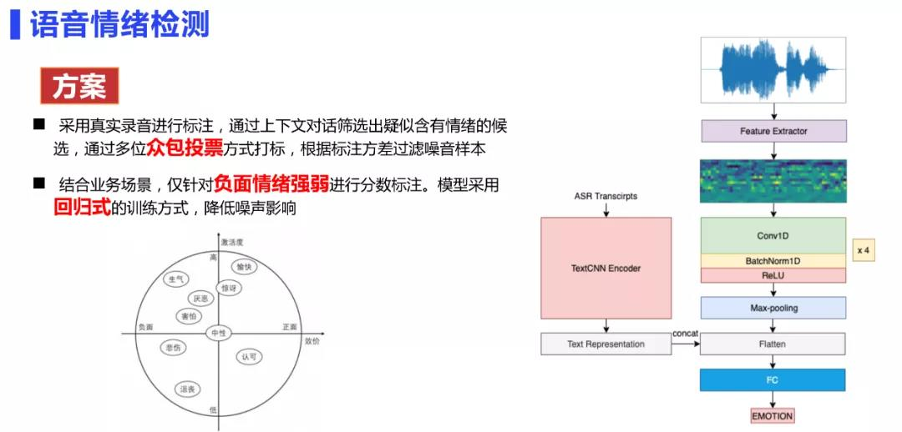

  - 语音情绪检测任务的核心并不在于模型的创新，而在于如何去构造一个能用的数据集。首先摒弃分类打标的方式：如左侧下方展示的效价图，通过情绪的正负面和强弱，将不同的情绪类型划分到不同象限里（目前更倾向于只做横向象限，忽略纵向象限，只标注情绪的负面程度）。如此就将分类问题转换成了回归问题，这样可以避免在两个分类状态之间难以选择，或是划分标准模糊的问题，相对来说标注数据的质量会好很多。同时也能通过增加样本量（标注量）的方式来减少标注误差，提高标注质量。

- 口语化表达：

  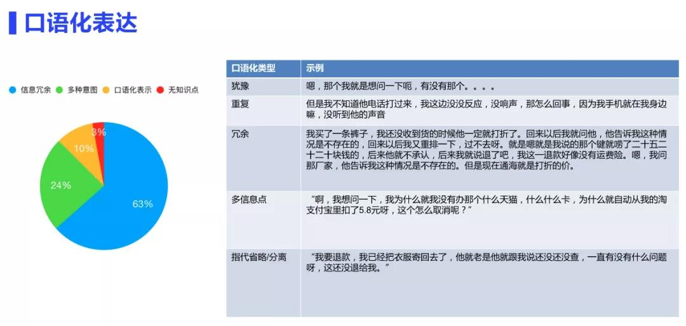

  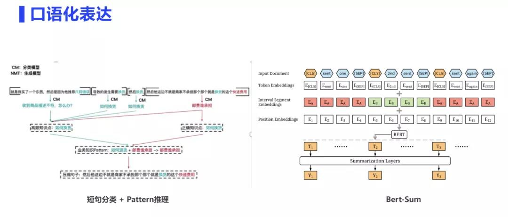

  - “短句分类+pattern推理”：虽然长句可能无法直接定位到一个意图，但每个短句是能够定位意图的。故可以通过先对短句（意图）定位，再利用短句间存在的因果关系，推理到最终意图。
  - “Bert-Sum”摘要

- 语音语义驱动的双工对话

  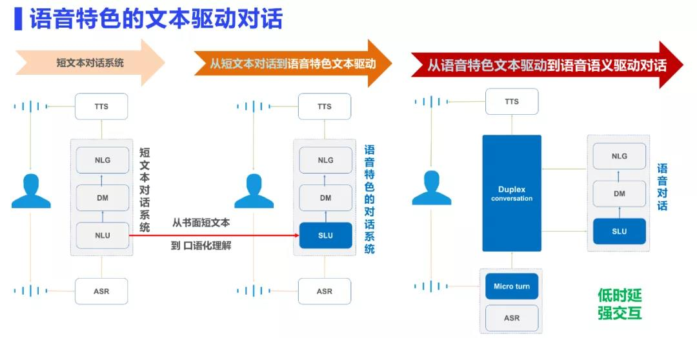

  如何实现双工操控？按照人类的表达来模拟，就是耳朵在听，脑子在想，嘴巴在说。如果把它变成一个机器人，就是需要控制收音，在收音时去控制什么时候能够触发双工动作，需要有这样的动作决策机制及执行的方法。

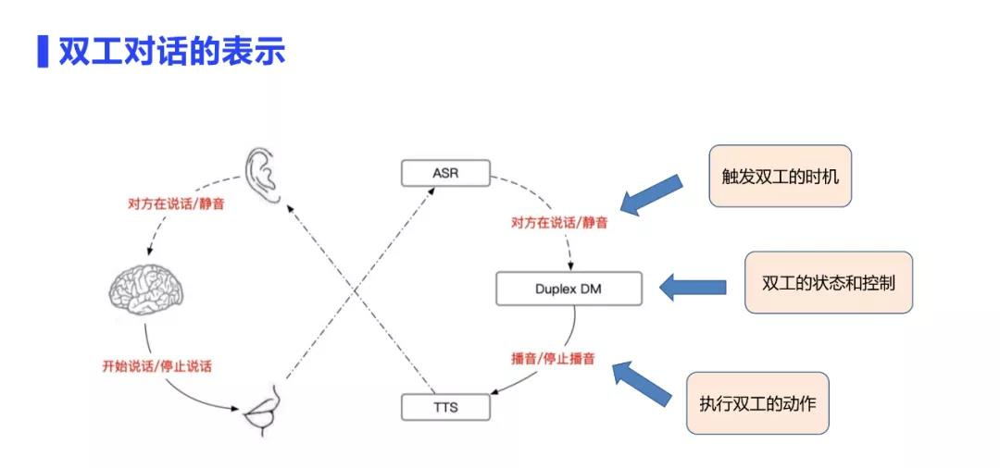

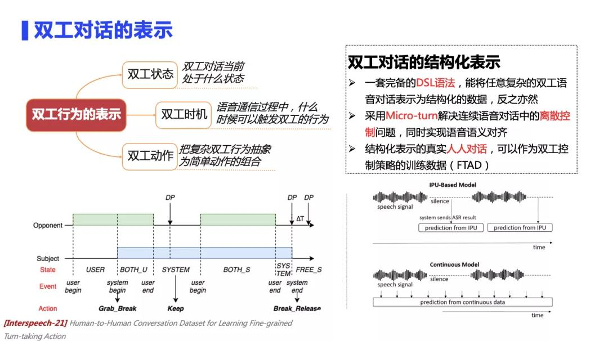

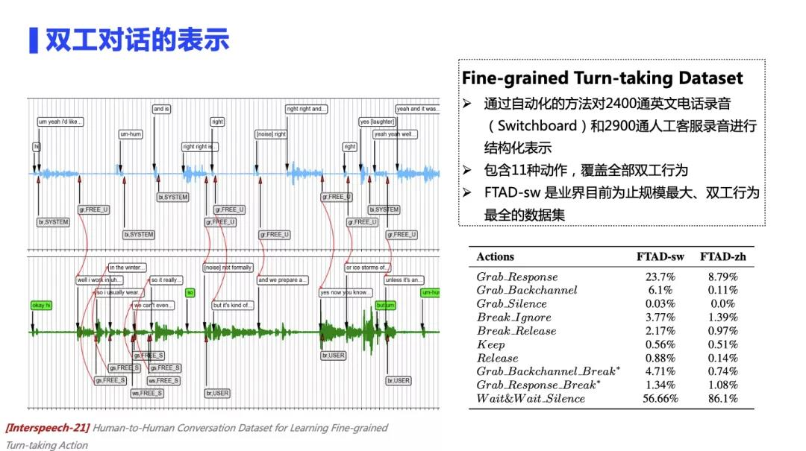

如何把复杂的双工对话转换成一段可以结构化的方案，核心在于左下角的图，即定义了一套DSL语法，可以将用户任意一段双工对话进行结构化，表示成“状态、事件、动作”这三个要素。其中第一层为state（状态），第二层为event（事件），第三层action（动作）。基于要素，可以表示一段对话，另一方面也能让Robot具有响应双工对话的能力。同时，对人人对话进行这样表述之后，能将此数据作为训练数据。

左图是对人人对话进行表示后得到的可视化结果。对Switchboard数据集中2400通英文对话进行了结构化表示，该数据集几乎包含了所有双工行为（该数据集通过InterSpeech 2021进行了公开），也是目前学术界规模最大最全的双工行为数据集。以上为双工对话的表示。

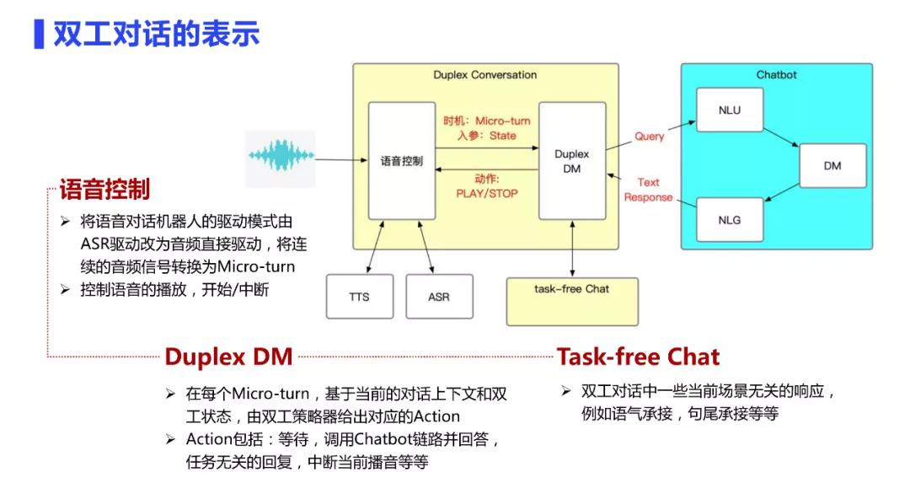

有了双工对话的表示后，需要对它进行控制。图中可以看到我们对传统五段式机器的改造，即插入Duplex-Conversation部分。Duplex-Conversation分为三个部分：第一个是ASR驱动的语音控制部分，由它来将ASR和TTS由原来的原子化驱动变为一个更精细化操作。第二个是DuplexDM，其功能是不断接收Micro-Turn（比Turn的粒度更细）的信息，即决策时机，然后根据时机的state和event，给出一个action（包括等待不回复，或是调用NLU链路进行回复，或进行一些任务无关的回复，如语气词、承接词等）。将回复分为任务相关回复和任务无关回复两个部分，其中任务无关回复称为Task-free Chat，任务相关回复其实就是原来传统的NLU、DM、NLG。通过这样的改造，使机器人具有双工交互的能力。

- 双工的交互能力

  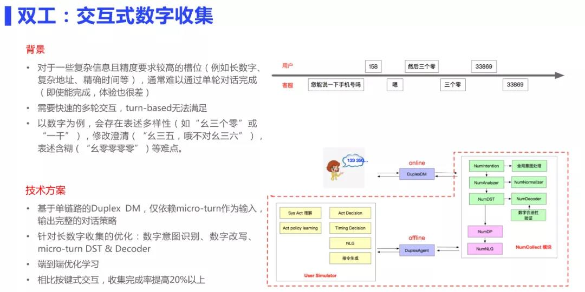

  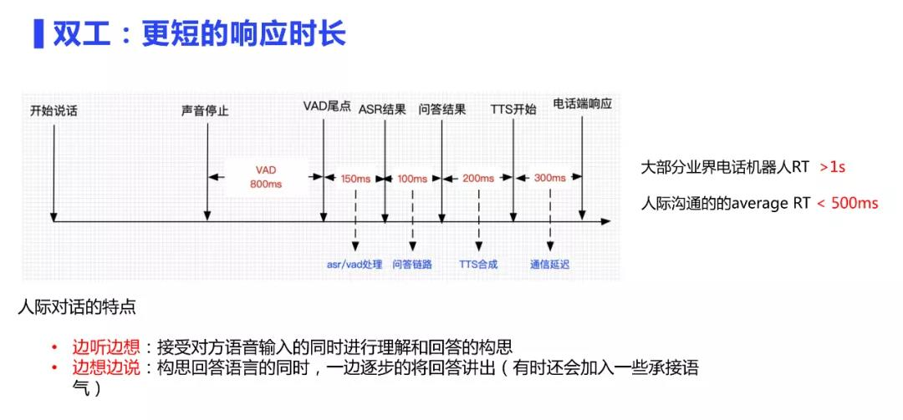

  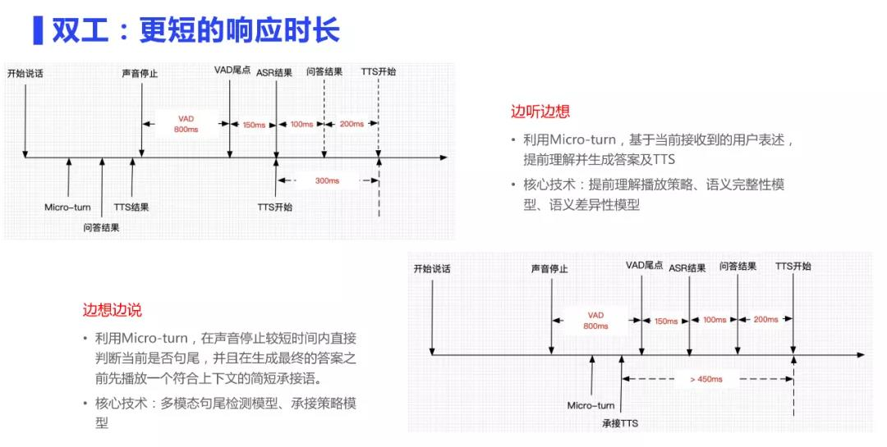

  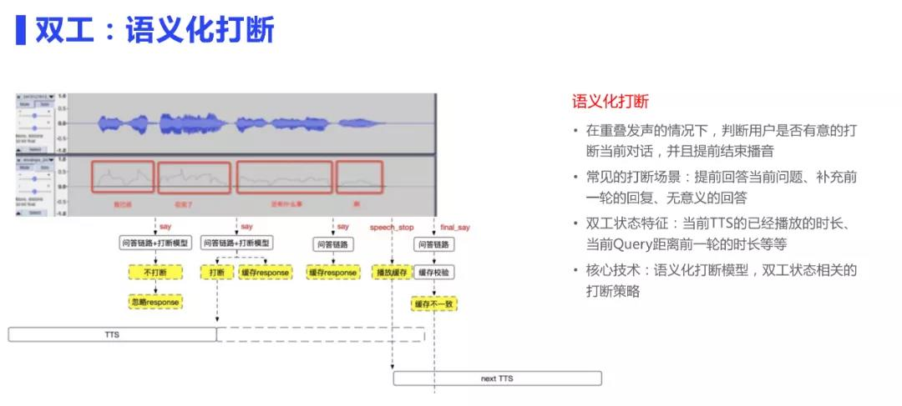

  - 更短的响应时长
  - 语义化打断
  - 交互式数字收集
  - 仿真环境

5 语音识别在未来十年还能做什么？

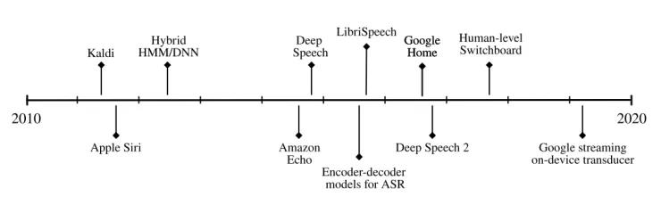

上图展示了过去十年中语音识别研究、软件和应用发展的是时间线。这十年我们见证了基于收集的语音助手的推出和流行。亚马逊alexa和google home等远场设备的发布。

- 由于深度学习的兴起，自动语音识别的单词错误率显著下降，关键的驱动因素包括：
  - 海量转录的数据集
  - GPU
  - 算法和模型的改进
- 曾经，Richard Hamming在《The Art of Doing Science and Engineering》中做出了许多预测，其中许多已经实现。这里有几个例子：
  - 到2020年，由应用领域的专家来编写程序而不是让计算机专家，这种现象将会是普遍的做法
  - 预测神经网络”代表了编程问题的解决方案“，并且”他们可能会在计算机的未来发挥重要的作用“
  - 他预测了通用而非专用的硬件、模拟数字和高级编程语音的流行
  - 早在交换机实际应用之前，他就预测了使用光纤代替铜线进行通信。
- 未来的预测：
  - 半监督学习：语音受益于半监督学习。考虑在更少的数据上进行有效训练的轻量化模型，更快训练的优化以及结合先验知识以提高效率的有效方法。
    - 第一种方法是自监督学习，其损失函数是基于对比预测编码的。这种做法非常简单：训练模型来预测给定过去音频的未来帧
    - 第二种方法是伪标记。使用经过训练的模型来预测未标记数据的标签，然后在预测的标签上训练一个新的模型。
  - 边缘计算：怎么轻量化模型：模型量化、知识蒸馏、稀疏性
    - 首先，数据保存在设备上而不是将其发送至中央服务器进行加密。数据隐私保护的趋势将带来设备端的计算需求。
    - 第二种原因就是延迟。从绝对值来看，10毫秒和100毫秒的差异并不大，但前者远低于人类的感知延迟，后者则远远高于。谷歌已经展示了在端上的语音识别的准确率会比云端的更好。从实际应用的角度，低延迟的设备端语音是被的交互更加灵敏和友好。
    - 最后一个原本因是100%的可用性，即使没有了互联网连接或连接不稳定的服务，识别器依然可以工作，这意味着它会一直工作。从用户交互的角度来看，大部分时间都有效的产品和每次都有效的产品之间存在很大的差异
  - 字错词率：
    - 从研究实验室转向工程组织
  - 更加丰富的表达：对于依赖语音识别器输出的下游任务，转录将被更丰富的表达所取代。其下游任务包括对话代理、基于语音的搜索查询、数字代理
    - 不关心逐字转录的准确性，而是关心语义的正确性。因此，提法语音识别器的单词错词率并不会完全提高下游任务。
  - 个性化：到2030年，语音识别模型将针对个人用户进行深度个性化。
    - 语音的自动识别与人类对语音的解释之间的主要区别之一在于上下文的使用。人类在相互交谈时会依赖很多上下文信息。此上下文包括对话的主题、过去所说的内容、噪声背景以唇部运动和面部表情等视觉线索。对于断章取义的简短话语（即长度小于10s），我们已经或即将达到语音是被的最优错词率。我们的模型正在尽其所能使用数据种的可用信息。
  - 应用预测
    - 转录服务：到2030年，99%的转录语音服务将通过自动语音识别来完成。人工转录员将执行质量控制并纠正或转录更困难的话语。转录服务包括例如为视频添加字幕、转录采访以及转录讲座或演讲。
    - 预测：语音助手会变得更好，但是需要一个过程。语音识别不再是更好的语音助手的瓶颈。瓶颈现在完全在语言理解领域，包括保持对话的能力、多重上下文响应以及更广泛的领域问答。我们将继续在这些所谓的AI‑complete问题上取得进展，但我不认为它们会在2030年得到解决。

4 音视频结合实现语音增强

Visual Speech Enhancement Without A Real Visual Stream

**论文：**

https://arxiv.org/abs/2012.10852

**代码：**

https://github.com/Sindhu-Hegde/pseudo-visual-speech-denoising

**视频：**

https://mp.weixin.qq.com/s/gdHg9QsrHGQZ3R1yXBXxng

5 语音编程可能成为软件开发的下一个前沿领域

语音编码背后的前提 -- 一种使用语音开发软件的方法，而不是用键盘和鼠标来编写代码。通过语音编码平台，程序员说出命令来操作代码，并创建自定义命令，以迎合和自动化他们的工作流程。